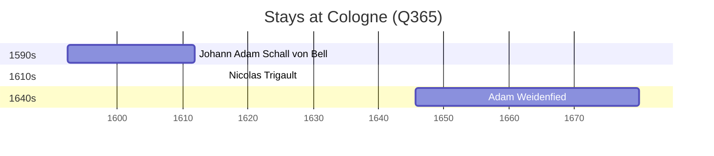

# Cologne (Q365)

*most populous city in North Rhine-Westphalia, Germany*

Wikidata: [Q365](https://www.wikidata.org/wiki/Q365)

3 occurrence(s) across 1 transcribed value(s), 3 person(s).

**Transcribed variants:**

- `Colónia` (3×, 1592–1645)

| Date | Variant | Person | Type | Entity id | Real entity |
|------|---------|--------|------|-----------|-------------|
| 1592-05-01 | Colónia | Johann Adam Schall von Bell | nascimento | [deh-johann-adam-schall-von-bell](deh-johann-adam-schall-von-bell) | — |
| 1645-09-08 | Colónia | Adam Weidenfied | nascimento | [deh-adam-weidenfied](deh-adam-weidenfied) | — |
| >1616-05 | Colónia | Nicolas Trigault | estadia | [deh-nicolas-trigault](deh-nicolas-trigault) | — |

