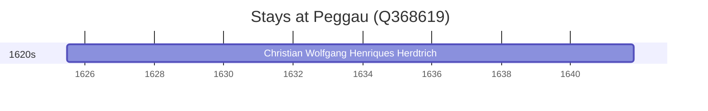

# Peggau (Q368619)

*municipality in Graz-Umgebung District, Styria, Austria*

Wikidata: [Q368619](https://www.wikidata.org/wiki/Q368619)

1 occurrence(s) across 1 transcribed value(s), 1 person(s).

**Transcribed variants:**

- `Peggau` (1×, 1625–1625)

| Date | Variant | Person | Type | Entity id | Real entity |
|------|---------|--------|------|-----------|-------------|
| 1625-06-25 | Peggau | Christian Wolfgang Henriques Herdtrich | nascimento | [deh-christian-wolfgang-henriques-herdtrich](deh-christian-wolfgang-henriques-herdtrich) | [rp669413](rp669413) |

