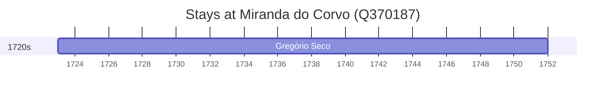

# Miranda do Corvo (Q370187)

*municipality of Portugal*

Wikidata: [Q370187](https://www.wikidata.org/wiki/Q370187)

2 occurrence(s) across 1 transcribed value(s), 2 person(s).

**Transcribed variants:**

- `Miranda do Corvo, diocese de Coimbra` (2×, 1723–1723)

| Date | Variant | Person | Type | Entity id | Real entity |
|------|---------|--------|------|-----------|-------------|
| — | Miranda do Corvo, diocese de Coimbra | Joseph de Seixas | nascimento | [deh-joao-de-seixas-ref4](deh-joao-de-seixas-ref4) | — |
| 1723 | Miranda do Corvo, diocese de Coimbra | Gregório Seco | nascimento | [deh-gregorio-seco](deh-gregorio-seco) | — |

