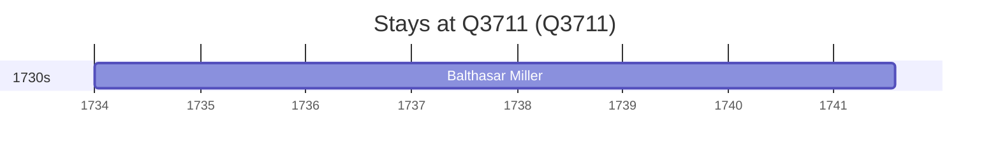

# Q3711

*(fetch error: HTTP Error 429: Too Many Requests)*

Wikidata: [Q3711](https://www.wikidata.org/wiki/Q3711)

1 occurrence(s) across 1 transcribed value(s), 1 person(s).

**Transcribed variants:**

- `Belgrado` (1×, 1734–1734)

| Date | Variant | Person | Type | Entity id | Real entity |
|------|---------|--------|------|-----------|-------------|
| 1734 | Belgrado | Balthasar Miller | estadia | [deh-balthasar-miller](deh-balthasar-miller) | — |

