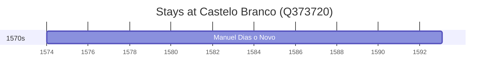

# Castelo Branco (Q373720)

*municipality in Portugal*

Wikidata: [Q373720](https://www.wikidata.org/wiki/Q373720)

1 occurrence(s) across 1 transcribed value(s), 1 person(s).

**Transcribed variants:**

- `Castelo Branco` (1×, 1574–1574)

| Date | Variant | Person | Type | Entity id | Real entity |
|------|---------|--------|------|-----------|-------------|
| 1574 | Castelo Branco | Manuel Dias, o Novo | nascimento | [deh-manuel-dias-o-novo](deh-manuel-dias-o-novo) | — |

