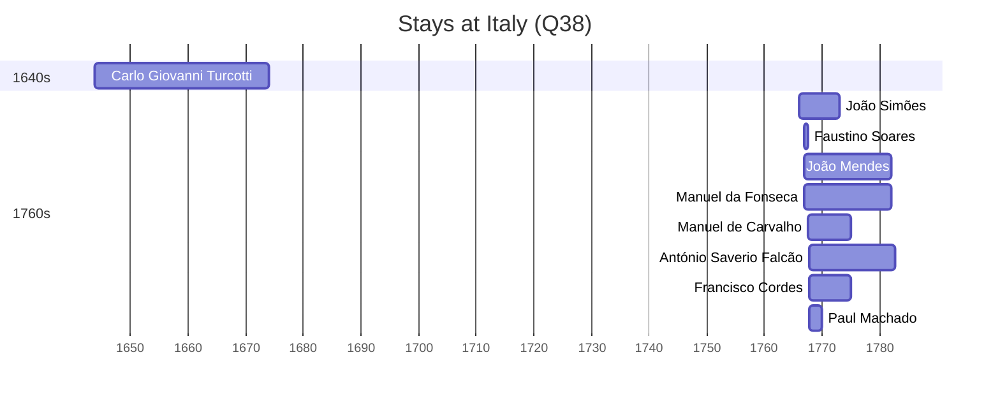

# Italy (Q38)

*country in southern Europe*

Wikidata: [Q38](https://www.wikidata.org/wiki/Q38)

17 occurrence(s) across 1 transcribed value(s), 15 person(s).

**Transcribed variants:**

- `Itália` (17×, 1643–1775)

| Date | Variant | Person | Type | Entity id | Real entity |
|------|---------|--------|------|-----------|-------------|
| — | Itália | Antonio Saverio Morabito | estadia | [deh-antonio-saverio-morabito](deh-antonio-saverio-morabito) | — |
| — | Itália | Dionísio Ferreira | estadia | [deh-dionisio-ferreira](deh-dionisio-ferreira) | — |
| — | Itália | José Montanha | estadia | [deh-jose-montanha-ii](deh-jose-montanha-ii) | — |
| 1643-10-09 | Itália | Carlo Giovanni Turcotti | nascimento | [deh-carlo-giovanni-turcotti](deh-carlo-giovanni-turcotti) | — |
| 1766 | Itália | João Simões | estadia | [deh-joao-simoes](deh-joao-simoes) | — |
| 1767 | Itália | Faustino Soares | estadia | [deh-faustino-soares](deh-faustino-soares) | — |
| 1767 | Itália | Manuel da Fonseca | estadia | [deh-manuel-da-fonseca](deh-manuel-da-fonseca) | — |
| 1767 | Itália | João Mendes | estadia | [deh-joao-mendes](deh-joao-mendes) | — |
| 1767 | Itália | Symphorien Duarte | partida | [deh-symphorien-duarte](deh-symphorien-duarte) | — |
| 1767-07-09 | Itália | Manuel de Carvalho | estadia | [deh-manuel-de-carvalho](deh-manuel-de-carvalho) | — |
| 1767-09-06 | Itália | António Saverio Falcão | estadia | [deh-antonio-saverio-falcao](deh-antonio-saverio-falcao) | — |
| 1767-09-06 | Itália | Francisco da Silva | partida | [deh-francisco-da-silva-iii](deh-francisco-da-silva-iii) | — |
| 1767-09-06 | Itália | Francisco Cordes | estadia | [deh-francisco-de-cordes](deh-francisco-de-cordes) | — |
| 1767-09-06 | Itália | Paul Machado | estadia | [deh-paul-machado](deh-paul-machado) | — |
| 1767-09-06 | Itália | Xavier Duarte | partida | [deh-xavier-duarte](deh-xavier-duarte) | — |
| 1773 | Itália | João Simões | morte | [deh-joao-simoes](deh-joao-simoes) | — |
| 1775 | Itália | Symphorien Duarte | morte | [deh-symphorien-duarte](deh-symphorien-duarte) | — |

### Co-presence

These persons were plausibly at this place during overlapping periods (interval estimation from stay dates; rough — see method note below).

| Period | Persons |
|--------|---------|
| 1760s | [Faustino Soares](deh-faustino-soares), [Francisco Cordes](deh-francisco-de-cordes), [João Simões](deh-joao-simoes), [Manuel de Carvalho](deh-manuel-de-carvalho), [Paul Machado](deh-paul-machado) |

*8 overlapping pair(s) involving 5 person(s). Method: interval start = stay event date; end = next embarque/partida/different-place event, or death, or +15yr cap.*

