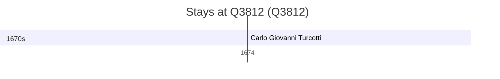

# Q3812

*(fetch error: HTTP Error 429: Too Many Requests)*

Wikidata: [Q3812](https://www.wikidata.org/wiki/Q3812)

1 occurrence(s) across 1 transcribed value(s), 1 person(s).

**Transcribed variants:**

- `Sulawesi` (1×, 1674–1674)

| Date | Variant | Person | Type | Entity id | Real entity |
|------|---------|--------|------|-----------|-------------|
| 1674 | Sulawesi | Carlo Giovanni Turcotti | estadia | [deh-carlo-giovanni-turcotti](deh-carlo-giovanni-turcotti) | — |

