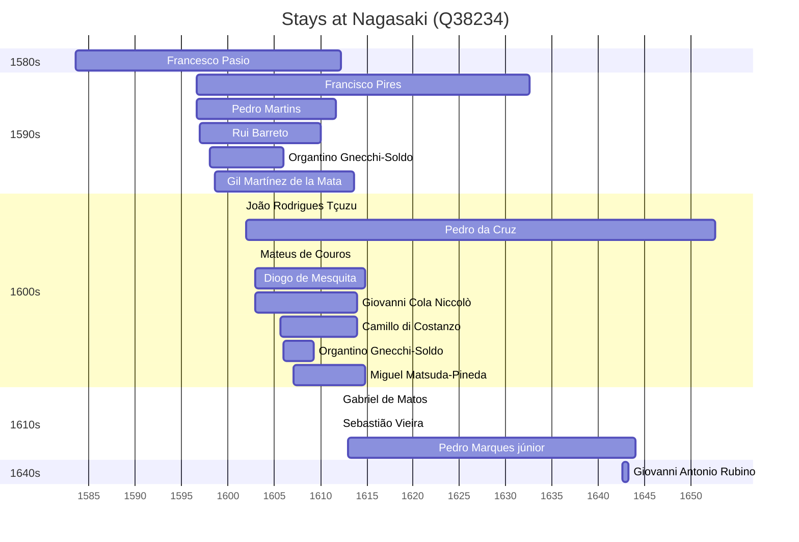

# Nagasaki (Q38234)

*core city in Kyushu, Japan*

Wikidata: [Q38234](https://www.wikidata.org/wiki/Q38234)

28 occurrence(s) across 2 transcribed value(s), 20 person(s).

**Transcribed variants:**

- `Nagasaki` (27×, 1583–1643)
- `Todos-os-Santos, Nagasaki` (1×, 1607–1607)

| Date | Variant | Person | Type | Entity id | Real entity |
|------|---------|--------|------|-----------|-------------|
| 1583-07-25 | Nagasaki | Francesco Pasio | estadia | [deh-francesco-pasio](deh-francesco-pasio) | — |
| 1596-08-14 | Nagasaki | Francisco Pires | estadia | [deh-francisco-pires](deh-francisco-pires) | — |
| 1596-08-14 | Nagasaki | Pedro Martins | chegada | [deh-pedro-martins](deh-pedro-martins) | — |
| 1597 | Nagasaki | Rui Barreto | estadia | [deh-rui-barreto](deh-rui-barreto) | — |
| 1598 | Nagasaki | Organtino Gnecchi-Soldo | estadia | [deh-organtino-gnecchi-soldo](deh-organtino-gnecchi-soldo) | — |
| 1598-08-12 | Nagasaki | Gil Martínez de la Mata | chegada | [deh-gil-martinez-de-la-mata](deh-gil-martinez-de-la-mata) | — |
| 1599-02-26 | Nagasaki | Gil Martínez de la Mata | estadia | [deh-gil-martinez-de-la-mata](deh-gil-martinez-de-la-mata) | — |
| 1601-06-10 | Nagasaki | João Rodrigues Tçuzu | jesuita-votos-local | [deh-joao-rodrigues-tcuzu](deh-joao-rodrigues-tcuzu) | — |
| 1602 | Nagasaki | Pedro da Cruz | nascimento | [deh-pedro-da-cruz](deh-pedro-da-cruz) | — |
| 1602-12-08 | Nagasaki | Mateus de Couros | jesuita-votos-local | [deh-mateus-de-couros](deh-mateus-de-couros) | — |
| 1603 | Nagasaki | Giovanni Cola Niccolò | estadia | [deh-giovanni-cola-niccolo](deh-giovanni-cola-niccolo) | — |
| 1603 | Nagasaki | Diogo de Mesquita | estadia | [deh-diogo-de-mesquita](deh-diogo-de-mesquita) | — |
| 1603-06-08 | Nagasaki | Giovanni Cola Niccolò | jesuita-votos-local | [deh-giovanni-cola-niccolo](deh-giovanni-cola-niccolo) | — |
| 1605-08-17 | Nagasaki | Camillo di Costanzo | chegada | [deh-camillo-di-costanzo](deh-camillo-di-costanzo) | — |
| 1606 | Nagasaki | Organtino Gnecchi-Soldo | estadia | [deh-organtino-gnecchi-soldo](deh-organtino-gnecchi-soldo) | — |
| 1607-02-02 | Todos-os-Santos, Nagasaki | Miguel Matsuda-Pineda | jesuita-entrada | [deh-miguel-matsuda-pineda](deh-miguel-matsuda-pineda) | — |
| 1609-04-22 | Nagasaki | Organtino Gnecchi-Soldo | morte | [deh-organtino-gnecchi-soldo](deh-organtino-gnecchi-soldo) | — |
| 1611-08 | Nagasaki | Pedro Ramón | morte | [deh-pedro-ramon](deh-pedro-ramon) | — |
| 1611-11-27 | Nagasaki | Gabriel de Matos | jesuita-votos-local | [deh-gabriel-de-matos](deh-gabriel-de-matos) | — |
| 1611-11-27 | Nagasaki | Sebastião Vieira | jesuita-votos-local | [deh-sebastiao-vieira](deh-sebastiao-vieira) | — |
| 1612-03-22 | Nagasaki | Francesco Pasio | estadia | [deh-francesco-pasio](deh-francesco-pasio) | — |
| 1613 | Nagasaki | Pedro Marques, júnior | nascimento | [deh-pedro-marques-junior](deh-pedro-marques-junior) | — |
| 1614-02-15 | Nagasaki | Luís Cerqueira | morte | [deh-luis-cerqueira](deh-luis-cerqueira) | — |
| 1614-11-04 | Nagasaki | Diogo de Mesquita | morte | [deh-diogo-de-mesquita](deh-diogo-de-mesquita) | — |
| 1626-06-20 | Nagasaki | Francisco Pacheco | morte | [deh-francisco-pacheco](deh-francisco-pacheco) | — |
| 1632-10 | Nagasaki | Miguel Matsuda-Pineda | morte | [deh-miguel-matsuda-pineda](deh-miguel-matsuda-pineda) | — |
| 1642-08-11 | Nagasaki | Giovanni Antonio Rubino | estadia | [deh-giovanni-antonio-rubino](deh-giovanni-antonio-rubino) | — |
| 1643-03-22 | Nagasaki | Giovanni Antonio Rubino | morte | [deh-giovanni-antonio-rubino](deh-giovanni-antonio-rubino) | — |

### Co-presence

These persons were plausibly at this place during overlapping periods (interval estimation from stay dates; rough — see method note below).

| Period | Persons |
|--------|---------|
| 1590s | [Francesco Pasio](deh-francesco-pasio), [Francisco Pires](deh-francisco-pires), [Organtino Gnecchi-Soldo](deh-organtino-gnecchi-soldo), [Rui Barreto](deh-rui-barreto) |
| 1600s | [Camillo di Costanzo](deh-camillo-di-costanzo), [Diogo de Mesquita](deh-diogo-de-mesquita), [Francesco Pasio](deh-francesco-pasio), [Francisco Pires](deh-francisco-pires), [Giovanni Cola Niccolò](deh-giovanni-cola-niccolo), [João Rodrigues Tçuzu](deh-joao-rodrigues-tcuzu), [Mateus de Couros](deh-mateus-de-couros), [Miguel Matsuda-Pineda](deh-miguel-matsuda-pineda), [Organtino Gnecchi-Soldo](deh-organtino-gnecchi-soldo), [Pedro da Cruz](deh-pedro-da-cruz), [Rui Barreto](deh-rui-barreto) |
| 1610s | [Camillo di Costanzo](deh-camillo-di-costanzo), [Diogo de Mesquita](deh-diogo-de-mesquita), [Francesco Pasio](deh-francesco-pasio), [Francisco Pires](deh-francisco-pires), [Gabriel de Matos](deh-gabriel-de-matos), [Giovanni Cola Niccolò](deh-giovanni-cola-niccolo), [Miguel Matsuda-Pineda](deh-miguel-matsuda-pineda), [Pedro Marques, júnior](deh-pedro-marques-junior), [Pedro da Cruz](deh-pedro-da-cruz), [Sebastião Vieira](deh-sebastiao-vieira) |
| 1640s | [Giovanni Antonio Rubino](deh-giovanni-antonio-rubino), [Pedro Marques, júnior](deh-pedro-marques-junior), [Pedro da Cruz](deh-pedro-da-cruz) |

*74 overlapping pair(s) involving 15 person(s). Method: interval start = stay event date; end = next embarque/partida/different-place event, or death, or +15yr cap.*

