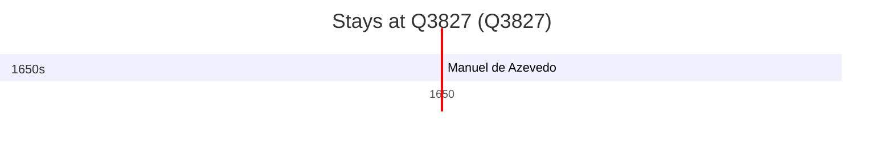

# Q3827

*(fetch error: HTTP Error 429: Too Many Requests)*

Wikidata: [Q3827](https://www.wikidata.org/wiki/Q3827)

2 occurrence(s) across 1 transcribed value(s), 2 person(s).

**Transcribed variants:**

- `Molucas` (2×, undated)

| Date | Variant | Person | Type | Entity id | Real entity |
|------|---------|--------|------|-----------|-------------|
| — | Molucas | Cosmas Torres | estadia | [deh-cosmas-torres](deh-cosmas-torres) | — |
| >1614-04-08:<1637 | Molucas | Manuel de Azevedo | estadia | [deh-manuel-de-azevedo](deh-manuel-de-azevedo) | — |

