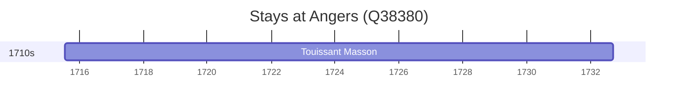

# Angers (Q38380)

*commune in Maine-et-Loire, Pays de la Loire, France*

Wikidata: [Q38380](https://www.wikidata.org/wiki/Q38380)

1 occurrence(s) across 1 transcribed value(s), 1 person(s).

**Transcribed variants:**

- `Angers` (1×, 1715–1715)

| Date | Variant | Person | Type | Entity id | Real entity |
|------|---------|--------|------|-----------|-------------|
| 1715-07-22 | Angers | Touissant Masson | nascimento | [deh-touissant-masson](deh-touissant-masson) | — |

