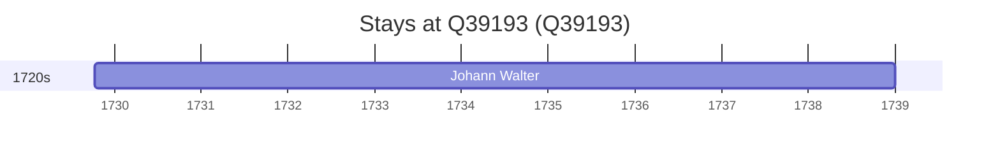

# Q39193

*(fetch error: HTTP Error 429: Too Many Requests)*

Wikidata: [Q39193](https://www.wikidata.org/wiki/Q39193)

1 occurrence(s) across 1 transcribed value(s), 1 person(s).

**Transcribed variants:**

- `Boémia` (1×, 1729–1729)

| Date | Variant | Person | Type | Entity id | Real entity |
|------|---------|--------|------|-----------|-------------|
| 1729-10-10 | Boémia | Johann Walter | jesuita-entrada | [deh-johann-walter](deh-johann-walter) | — |

