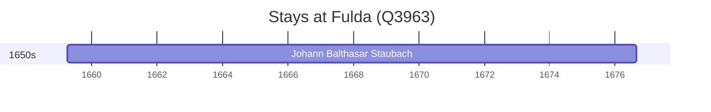

# Fulda (Q3963)

*seat of Landkreis Fulda and city in Hesse, Germany*

Wikidata: [Q3963](https://www.wikidata.org/wiki/Q3963)

1 occurrence(s) across 1 transcribed value(s), 1 person(s).

**Transcribed variants:**

- `Fulda` (1×, 1659–1659)

| Date | Variant | Person | Type | Entity id | Real entity |
|------|---------|--------|------|-----------|-------------|
| 1659-04-01 | Fulda | Johann Balthasar Staubach | nascimento | [deh-johann-balthasar-staubach](deh-johann-balthasar-staubach) | — |

