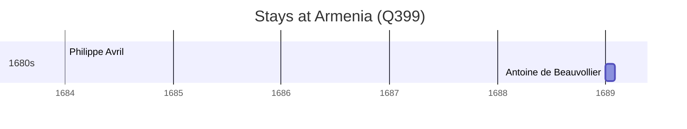

# Armenia (Q399)

*sovereign state in the South Caucasus region of Eurasia*

Wikidata: [Q399](https://www.wikidata.org/wiki/Q399)

2 occurrence(s) across 1 transcribed value(s), 2 person(s).

**Transcribed variants:**

- `Arménia` (2×, undated)

| Date | Variant | Person | Type | Entity id | Real entity |
|------|---------|--------|------|-----------|-------------|
| >1684:<1687-01-15 | Arménia | Philippe Avril | estadia | [deh-philippe-avril](deh-philippe-avril) | [rp636254](rp636254) |
| >1689 | Arménia | Antoine de Beauvollier | estadia | [deh-antoine-de-beauvollier](deh-antoine-de-beauvollier) | — |

