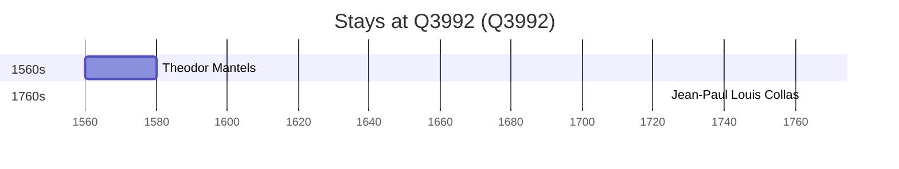

# Q3992

*(fetch error: HTTP Error 429: Too Many Requests)*

Wikidata: [Q3992](https://www.wikidata.org/wiki/Q3992)

2 occurrence(s) across 2 transcribed value(s), 2 person(s).

**Transcribed variants:**

- `Liège` (1×, 1560–1560)
- `Liége` (1×, 1762–1762)

| Date | Variant | Person | Type | Entity id | Real entity |
|------|---------|--------|------|-----------|-------------|
| 1560 | Liège | Theodor Mantels | nascimento | [deh-theodor-mantels](deh-theodor-mantels) | — |
| 1762-09-13 | Liége | Jean-Paul Louis Collas | jesuita-ordenacao-padre | [deh-jean-paul-louis-collas](deh-jean-paul-louis-collas) | — |

