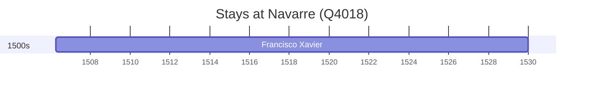

# Navarre (Q4018)

*chartered community of Spain*

Wikidata: [Q4018](https://www.wikidata.org/wiki/Q4018)

1 occurrence(s) across 1 transcribed value(s), 1 person(s).

**Transcribed variants:**

- `Navarra (palácio de Xavier)` (1×, 1506–1506)

| Date | Variant | Person | Type | Entity id | Real entity |
|------|---------|--------|------|-----------|-------------|
| 1506-04-07 | Navarra (palácio de Xavier) | Francisco Xavier | nascimento | [deh-francisco-xavier](deh-francisco-xavier) | — |

