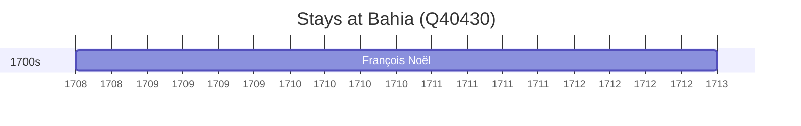

# Bahia (Q40430)

*state in the Northeast Region of Brazil*

Wikidata: [Q40430](https://www.wikidata.org/wiki/Q40430)

3 occurrence(s) across 3 transcribed value(s), 3 person(s).

**Transcribed variants:**

- `Baía` (1×, 1708–1708)
- `Baía, Brasil` (1×, 1730–1730)
- `[No mar, perto da Baía]` (1×, 1764–1764)

| Date | Variant | Person | Type | Entity id | Real entity |
|------|---------|--------|------|-----------|-------------|
| 1708-07-01 | Baía | François Noël | estadia | [deh-francois-noel](deh-francois-noel) | — |
| 1730-09-29 | Baía, Brasil | Charles de Belleville | morte | [deh-charles-de-belleville](deh-charles-de-belleville) | [rp033271](rp033271) |
| 1764-05-07 | [No mar, perto da Baía] | Gabriel Boussel | morte | [deh-gabriel-boussel](deh-gabriel-boussel) | [rp796803](rp796803) |

