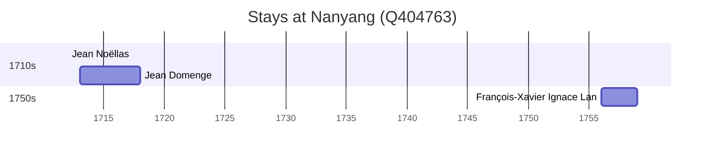

# Nanyang (Q404763)

*prefecture-level city in Henan, China*

Wikidata: [Q404763](https://www.wikidata.org/wiki/Q404763)

3 occurrence(s) across 2 transcribed value(s), 3 person(s).

**Transcribed variants:**

- `Nanyang fou, Honan` (2×, 1712–1713)
- `Nanyang, Honan` (1×, 1756–1756)

| Date | Variant | Person | Type | Entity id | Real entity |
|------|---------|--------|------|-----------|-------------|
| 1712 | Nanyang fou, Honan | Jean Noëllas | estadia | [deh-jean-noellas](deh-jean-noellas) | — |
| 1713 | Nanyang fou, Honan | Jean Domenge | estadia | [deh-jean-domenge](deh-jean-domenge) | — |
| 1756 | Nanyang, Honan | François-Xavier Ignace Lan | estadia | [deh-francois-xavier-ignace-lan](deh-francois-xavier-ignace-lan) | — |

