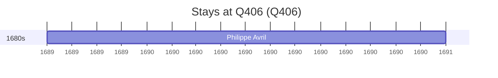

# Q406

*(fetch error: HTTP Error 429: Too Many Requests)*

Wikidata: [Q406](https://www.wikidata.org/wiki/Q406)

2 occurrence(s) across 1 transcribed value(s), 2 person(s).

**Transcribed variants:**

- `Istambul` (2×, 1689–1689)

| Date | Variant | Person | Type | Entity id | Real entity |
|------|---------|--------|------|-----------|-------------|
| — | Istambul | Johann Grueber | estadia | [deh-johann-grueber](deh-johann-grueber) | — |
| 1689-09 | Istambul | Philippe Avril | estadia | [deh-philippe-avril](deh-philippe-avril) | [rp636254](rp636254) |

