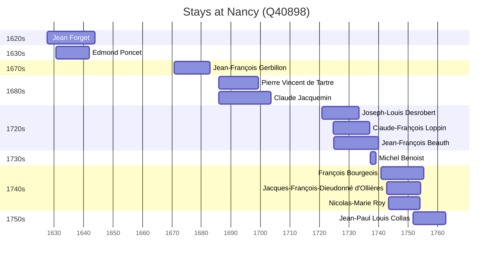

# Nancy (Q40898)

*city and commune in Meurthe-et-Moselle, Grand Est, France*

Wikidata: [Q40898](https://www.wikidata.org/wiki/Q40898)

13 occurrence(s) across 1 transcribed value(s), 13 person(s).

**Transcribed variants:**

- `Nancy` (13×, 1627–1751)

| Date | Variant | Person | Type | Entity id | Real entity |
|------|---------|--------|------|-----------|-------------|
| 1627-09-29 | Nancy | Jean Forget | jesuita-entrada | [deh-jean-forget](deh-jean-forget) | — |
| 1630-10-06 | Nancy | Edmond Poncet | jesuita-entrada | [deh-edmond-poncet](deh-edmond-poncet) | — |
| 1670-10-06 | Nancy | Jean-François Gerbillon | jesuita-entrada | [deh-jean-francois-gerbillon](deh-jean-francois-gerbillon) | — |
| 1685-10-14 | Nancy | Pierre Vincent de Tartre | jesuita-entrada | [deh-pierre-vincent-de-tartre](deh-pierre-vincent-de-tartre) | — |
| 1685-10-25 | Nancy | Claude Jacquemin | jesuita-entrada | [deh-claude-jacquemin](deh-claude-jacquemin) | — |
| 1720-09-21 | Nancy | Joseph-Louis Desrobert | jesuita-entrada | [deh-joseph-louis-desrobert](deh-joseph-louis-desrobert) | — |
| 1724-09-01 | Nancy | Claude-François Loppin | jesuita-entrada | [deh-claude-francois-loppin](deh-claude-francois-loppin) | — |
| 1724-09-25 | Nancy | Jean-François Beauth | jesuita-entrada | [deh-jean-francois-beauth](deh-jean-francois-beauth) | — |
| 1737-03-19 | Nancy | Michel Benoist | jesuita-entrada | [deh-michel-benoist](deh-michel-benoist) | — |
| 1740-09-17 | Nancy | François Bourgeois | jesuita-entrada | [deh-francois-bourgeois](deh-francois-bourgeois) | — |
| 1742-10-12 | Nancy | Jacques-François-Dieudonné d'Ollières | jesuita-entrada | [deh-jacques-francois-dieudonne-dollieres](deh-jacques-francois-dieudonne-dollieres) | — |
| 1743-04-07 | Nancy | Nicolas-Marie Roy | jesuita-entrada | [deh-nicolas-marie-roy](deh-nicolas-marie-roy) | — |
| 1751-08-27 | Nancy | Jean-Paul Louis Collas | jesuita-entrada | [deh-jean-paul-louis-collas](deh-jean-paul-louis-collas) | — |

### Co-presence

These persons were plausibly at this place during overlapping periods (interval estimation from stay dates; rough — see method note below).

| Period | Persons |
|--------|---------|
| 1630s | [Edmond Poncet](deh-edmond-poncet), [Jean Forget](deh-jean-forget) |
| 1680s | [Claude Jacquemin](deh-claude-jacquemin), [Pierre Vincent de Tartre](deh-pierre-vincent-de-tartre) |
| 1720s | [Claude-François Loppin](deh-claude-francois-loppin), [Jean-François Beauth](deh-jean-francois-beauth), [Joseph-Louis Desrobert](deh-joseph-louis-desrobert) |
| 1730s | [Jean-François Beauth](deh-jean-francois-beauth), [Michel Benoist](deh-michel-benoist) |
| 1740s | [François Bourgeois](deh-francois-bourgeois), [Jacques-François-Dieudonné d'Ollières](deh-jacques-francois-dieudonne-dollieres), [Nicolas-Marie Roy](deh-nicolas-marie-roy) |
| 1750s | [François Bourgeois](deh-francois-bourgeois), [Jacques-François-Dieudonné d'Ollières](deh-jacques-francois-dieudonne-dollieres), [Jean-Paul Louis Collas](deh-jean-paul-louis-collas), [Nicolas-Marie Roy](deh-nicolas-marie-roy) |

*12 overlapping pair(s) involving 12 person(s). Method: interval start = stay event date; end = next embarque/partida/different-place event, or death, or +15yr cap.*

