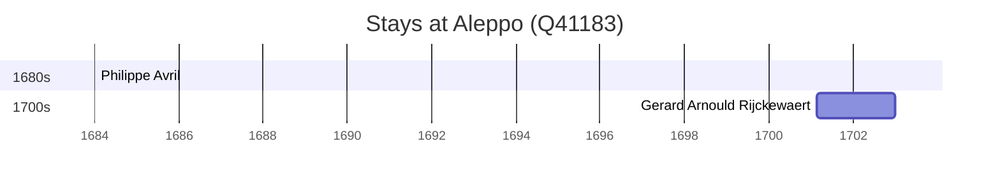

# Aleppo (Q41183)

*city in Aleppo Governorate, Syria*

Wikidata: [Q41183](https://www.wikidata.org/wiki/Q41183)

2 occurrence(s) across 1 transcribed value(s), 2 person(s).

**Transcribed variants:**

- `Alepo` (2×, 1701–1701)

| Date | Variant | Person | Type | Entity id | Real entity |
|------|---------|--------|------|-----------|-------------|
| 1701-02-22 | Alepo | Gerard Arnould Rijckewaert | estadia | [deh-gerard-arnould-rijckewaert](deh-gerard-arnould-rijckewaert) | — |
| >1684:<1687-01-15 | Alepo | Philippe Avril | estadia | [deh-philippe-avril](deh-philippe-avril) | [rp636254](rp636254) |

