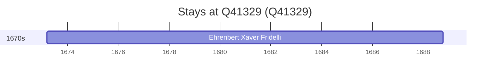

# Q41329

*(fetch error: HTTP Error 429: Too Many Requests)*

Wikidata: [Q41329](https://www.wikidata.org/wiki/Q41329)

1 occurrence(s) across 1 transcribed value(s), 1 person(s).

**Transcribed variants:**

- `Linz` (1×, 1673–1673)

| Date | Variant | Person | Type | Entity id | Real entity |
|------|---------|--------|------|-----------|-------------|
| 1673-03-11 | Linz | Ehrenbert Xaver Fridelli | nascimento | [deh-ehrenbert-xaver-fridelli](deh-ehrenbert-xaver-fridelli) | — |

