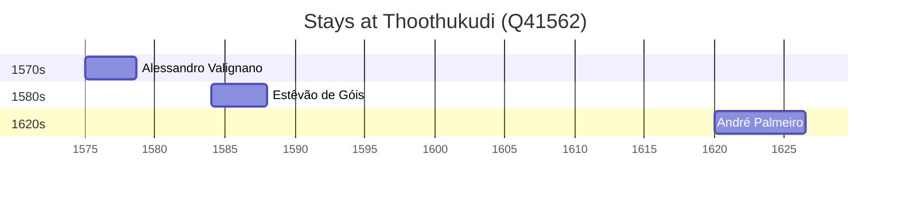

# Thoothukudi (Q41562)

*city in Tamil Nadu, India*

Wikidata: [Q41562](https://www.wikidata.org/wiki/Q41562)

5 occurrence(s) across 1 transcribed value(s), 3 person(s).

**Transcribed variants:**

- `Costa da Pescaria` (5×, 1575–1621)

| Date | Variant | Person | Type | Entity id | Real entity |
|------|---------|--------|------|-----------|-------------|
| 1575 | Costa da Pescaria | Alessandro Valignano | estadia | [deh-alessandro-valignano](deh-alessandro-valignano) | — |
| 1584 | Costa da Pescaria | Estêvão de Góis | estadia | [deh-estevao-de-gois](deh-estevao-de-gois) | — |
| 1588 | Costa da Pescaria | Estêvão de Góis | morte | [deh-estevao-de-gois](deh-estevao-de-gois) | — |
| 1620 | Costa da Pescaria | André Palmeiro | estadia | [deh-andre-palmeiro](deh-andre-palmeiro) | [rp983183](rp983183) |
| 1621-03 | Costa da Pescaria | André Palmeiro | estadia | [deh-andre-palmeiro](deh-andre-palmeiro) | [rp983183](rp983183) |

