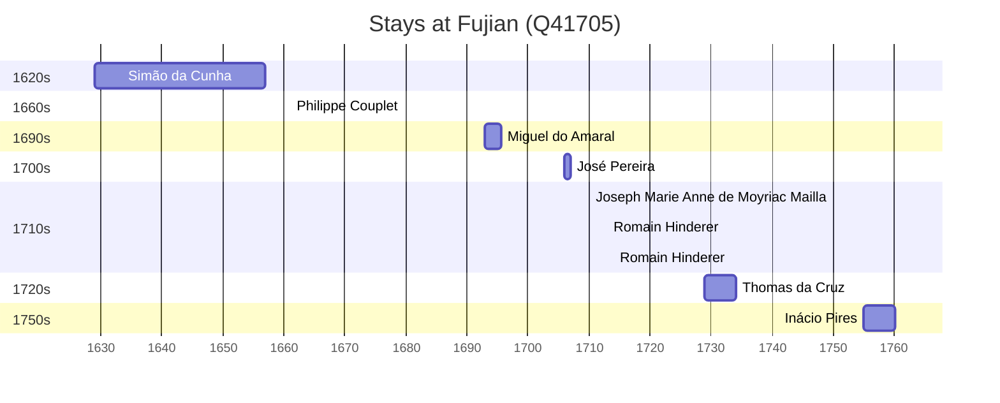

# Fujian (Q41705)

*province of the People's Republic of China, covering the mountainous coast opposite Taiwan*

Wikidata: [Q41705](https://www.wikidata.org/wiki/Q41705)

15 occurrence(s) across 3 transcribed value(s), 14 person(s).

**Transcribed variants:**

- `Fukien` (13×, 1611–1755)
- `Fou-kien` (1×, undated)
- `Foukien` (1×, undated)

| Date | Variant | Person | Type | Entity id | Real entity |
|------|---------|--------|------|-----------|-------------|
| — | Foukien | Diogo Vidal | estadia | [deh-diogo-vidal](deh-diogo-vidal) | — |
| — | Fukien | Etienne Baptista P'eng | estadia | [deh-etienne-baptista-peng](deh-etienne-baptista-peng) | — |
| — | Fou-kien | Louis Gobet | estadia | [deh-louis-gobet](deh-louis-gobet) | — |
| — | Fukien | Martino Martini | estadia | [deh-martino-martini](deh-martino-martini) | — |
| 1611 | Fukien | Rui Barreto | morte | [deh-rui-barreto](deh-rui-barreto) | — |
| 1611 | Fukien | António de Abreu | morte | [deh-rui-barreto-ref1](deh-rui-barreto-ref1) | [rp796356](rp796356) |
| 1629 | Fukien | Simão da Cunha | estadia | [deh-simao-da-cunha](deh-simao-da-cunha) | — |
| 1661 | Fukien | Philippe Couplet | estadia | [deh-philippe-couplet](deh-philippe-couplet) | [rp551005](rp551005) |
| 1693 | Fukien | Miguel do Amaral | estadia | [deh-miguel-do-amaral](deh-miguel-do-amaral) | [rp086368](rp086368) |
| 1706 | Fukien | José Pereira | estadia | [deh-jose-pereira](deh-jose-pereira) | — |
| 1710 | Fukien | Joseph Marie Anne de Moyriac Mailla | estadia | [deh-joseph-marie-anne-de-moyriac-mailla](deh-joseph-marie-anne-de-moyriac-mailla) | — |
| 1713 | Fukien | Romain Hinderer | estadia | [deh-romain-hinderer](deh-romain-hinderer) | — |
| 1714 | Fukien | Romain Hinderer | estadia | [deh-romain-hinderer](deh-romain-hinderer) | — |
| 1729 | Fukien | Thomas da Cruz | estadia | [deh-thomas-da-cruz](deh-thomas-da-cruz) | — |
| 1755 | Fukien | Inácio Pires | estadia | [deh-inacio-pires](deh-inacio-pires) | — |

