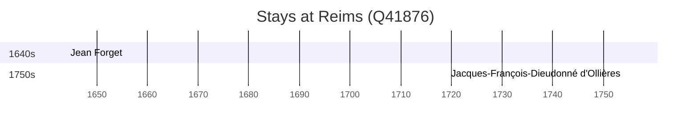

# Reims (Q41876)

*city in Marne, France*

Wikidata: [Q41876](https://www.wikidata.org/wiki/Q41876)

2 occurrence(s) across 1 transcribed value(s), 2 person(s).

**Transcribed variants:**

- `Reims` (2×, 1643–1754)

| Date | Variant | Person | Type | Entity id | Real entity |
|------|---------|--------|------|-----------|-------------|
| 1643-12-27 | Reims | Jean Forget | jesuita-votos-local | [deh-jean-forget](deh-jean-forget) | — |
| 1754-03-12 | Reims | Jacques-François-Dieudonné d'Ollières | jesuita-ordenacao-padre | [deh-jacques-francois-dieudonne-dollieres](deh-jacques-francois-dieudonne-dollieres) | — |

