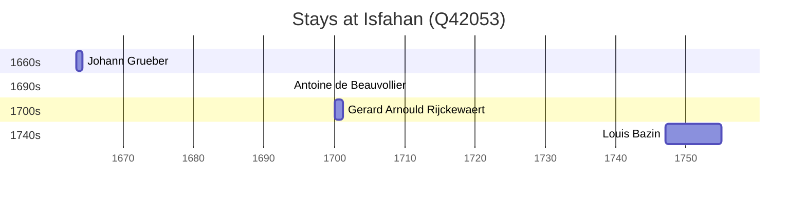

# Isfahan (Q42053)

*city in Isfahan Province, Iran*

Wikidata: [Q42053](https://www.wikidata.org/wiki/Q42053)

7 occurrence(s) across 2 transcribed value(s), 5 person(s).

**Transcribed variants:**

- `Isfahan, Pérsia` (6×, 1660–1747)
- `Isfahan (Nova Julfa), Pérsia` (1×, 1693–1693)

| Date | Variant | Person | Type | Entity id | Real entity |
|------|---------|--------|------|-----------|-------------|
| — | Isfahan, Pérsia | Johann Grueber | estadia | [deh-johann-grueber](deh-johann-grueber) | — |
| 1660-11-05 | Isfahan, Pérsia | Alexandre de Rhodes | morte | [deh-alexandre-de-rhodes](deh-alexandre-de-rhodes) | — |
| 1663-05 | Isfahan, Pérsia | Johann Grueber | estadia | [deh-johann-grueber](deh-johann-grueber) | — |
| 1663-05-28 | Isfahan, Pérsia | Johann Grueber | estadia | [deh-johann-grueber](deh-johann-grueber) | — |
| 1693-06-29 | Isfahan (Nova Julfa), Pérsia | Antoine de Beauvollier | jesuita-votos-local | [deh-antoine-de-beauvollier](deh-antoine-de-beauvollier) | — |
| 1700 | Isfahan, Pérsia | Gerard Arnould Rijckewaert | estadia | [deh-gerard-arnould-rijckewaert](deh-gerard-arnould-rijckewaert) | — |
| 1747 | Isfahan, Pérsia | Louis Bazin | estadia | [deh-louis-bazin](deh-louis-bazin) | — |

