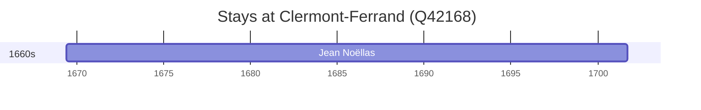

# Clermont-Ferrand (Q42168)

*commune in Puy-de-Dôme, France*

Wikidata: [Q42168](https://www.wikidata.org/wiki/Q42168)

2 occurrence(s) across 1 transcribed value(s), 1 person(s).

**Transcribed variants:**

- `Clermont-Ferrand` (2×, 1669–1669)

| Date | Variant | Person | Type | Entity id | Real entity |
|------|---------|--------|------|-----------|-------------|
| 1669-05-30 | Clermont-Ferrand | Jean Noëllas | nascimento | [deh-jean-noellas](deh-jean-noellas) | — |
| 1669-05-31 | Clermont-Ferrand | Jean Noëllas | baptizado | [deh-jean-noellas](deh-jean-noellas) | — |

