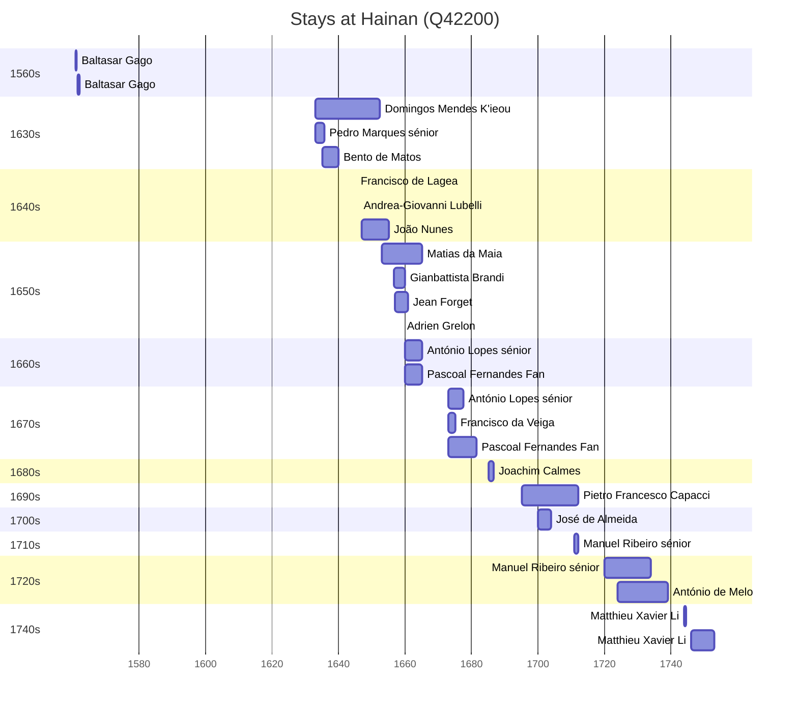

# Hainan (Q42200)

*province of China*

Wikidata: [Q42200](https://www.wikidata.org/wiki/Q42200)

42 occurrence(s) across 3 transcribed value(s), 26 person(s).

**Transcribed variants:**

- `Hainan` (39×, 1560–1746)
- `[Perto de Hainan]` (2×, 1646–1646)
- `[No mar, perto de Hainan]` (1×, 1651–1651)

| Date | Variant | Person | Type | Entity id | Real entity |
|------|---------|--------|------|-----------|-------------|
| — | Hainan | Bento de Matos | estadia | [deh-bento-de-matos](deh-bento-de-matos) | — |
| — | Hainan | Carlo Della Rocca | estadia | [deh-carlo-della-rocca](deh-carlo-della-rocca) | — |
| — | [Perto de Hainan] | Giovanni Filippo De Marini | estadia | [deh-giovanni-filippo-de-marini](deh-giovanni-filippo-de-marini) | — |
| — | Hainan | João de Borgia Kouo | estadia | [deh-joao-de-borgia-kouo](deh-joao-de-borgia-kouo) | — |
| — | Hainan | João Pacheco | estadia | [deh-joao-pacheco](deh-joao-pacheco) | — |
| — | Hainan | João Pereira | estadia | [deh-joao-pereira-ii](deh-joao-pereira-ii) | — |
| 1560-11 | Hainan | Baltasar Gago | estadia | [deh-baltasar-gago](deh-baltasar-gago) | — |
| 1561-05 | Hainan | Baltasar Gago | estadia | [deh-baltasar-gago](deh-baltasar-gago) | — |
| 1633 | Hainan | Domingos Mendes K'ieou | estadia | [deh-domingos-mendes-kieou](deh-domingos-mendes-kieou) | — |
| 1633 | Hainan | Pedro Marques, sénior | estadia | [deh-pedro-marques-senior](deh-pedro-marques-senior) | — |
| 1635 | Hainan | Bento de Matos | estadia | [deh-bento-de-matos](deh-bento-de-matos) | — |
| 1645 | Hainan | Francisco de Lagea | estadia | [deh-francisco-de-lagea](deh-francisco-de-lagea) | — |
| 1646-02-26 | [Perto de Hainan] | Gaspar do Amaral | morte | [deh-gaspar-do-amaral](deh-gaspar-do-amaral) | — |
| 1646:1652 | Hainan | Andrea-Giovanni Lubelli | estadia | [deh-andrea-giovanni-lubelli](deh-andrea-giovanni-lubelli) | — |
| 1647 | Hainan | João Nunes | chegada | [deh-joao-nunes](deh-joao-nunes) | — |
| 1651-12-12 | [No mar, perto de Hainan] | Bento de Matos | morte | [deh-bento-de-matos](deh-bento-de-matos) | — |
| 1653 | Hainan | Matias da Maia | estadia | [deh-matias-da-maia](deh-matias-da-maia) | — |
| 1656-06-22 | Hainan | Gianbattista Brandi | estadia | [deh-gianbattista-brandi](deh-gianbattista-brandi) | — |
| 1656-11-08 | Hainan | Matias da Maia | estadia | [deh-matias-da-maia](deh-matias-da-maia) | — |
| 1657 | Hainan | Jean Forget | estadia | [deh-jean-forget](deh-jean-forget) | — |
| 1660 | Hainan | António Lopes, sénior | estadia | [deh-antonio-lopes-senior](deh-antonio-lopes-senior) | — |
| 1660 | Hainan | Pascoal Fernandes Fan | estadia | [deh-pascoal-fernandes-fan](deh-pascoal-fernandes-fan) | — |
| 1662 | Hainan | António Lopes, sénior | estadia | [deh-antonio-lopes-senior](deh-antonio-lopes-senior) | — |
| 1662 | Hainan | Pascoal Fernandes Fan | estadia | [deh-pascoal-fernandes-fan](deh-pascoal-fernandes-fan) | — |
| 1673 | Hainan | António Lopes, sénior | estadia | [deh-antonio-lopes-senior](deh-antonio-lopes-senior) | — |
| 1673 | Hainan | Francisco da Veiga | estadia | [deh-francisco-da-veiga](deh-francisco-da-veiga) | — |
| 1673 | Hainan | Pascoal Fernandes Fan | estadia | [deh-pascoal-fernandes-fan](deh-pascoal-fernandes-fan) | — |
| 1685 | Hainan | Joachim Calmes | estadia | [deh-joachim-calmes](deh-joachim-calmes) | — |
| 1686-10-09 | Hainan | Joachim Calmes | morte | [deh-joachim-calmes](deh-joachim-calmes) | — |
| 1695 | Hainan | Pietro Francesco Capacci | estadia | [deh-pietro-francesco-capacci](deh-pietro-francesco-capacci) | — |
| 1700 | Hainan | José de Almeida | estadia | [deh-jose-de-almeida-ii](deh-jose-de-almeida-ii) | — |
| 1701 | Hainan | Pietro Francesco Capacci | estadia | [deh-pietro-francesco-capacci](deh-pietro-francesco-capacci) | — |
| 1704 | Hainan | Pietro Francesco Capacci | estadia | [deh-pietro-francesco-capacci](deh-pietro-francesco-capacci) | — |
| 1704 | Hainan | José de Almeida | estadia | [deh-jose-de-almeida-ii](deh-jose-de-almeida-ii) | — |
| 1711 | Hainan | Manuel Ribeiro, sénior | estadia | [deh-manuel-ribeiro-senior](deh-manuel-ribeiro-senior) | — |
| 1720 | Hainan | Manuel Ribeiro, sénior | estadia | [deh-manuel-ribeiro-senior](deh-manuel-ribeiro-senior) | — |
| 1724 | Hainan | António de Melo | estadia | [deh-antonio-de-melo](deh-antonio-de-melo) | — |
| 1724-11-23 | Hainan | António de Melo | estadia | [deh-antonio-de-melo](deh-antonio-de-melo) | — |
| 1725 | Hainan | António de Melo | estadia | [deh-antonio-de-melo](deh-antonio-de-melo) | — |
| 1744 | Hainan | Matthieu Xavier Li | estadia | [deh-matthieu-xavier-li](deh-matthieu-xavier-li) | — |
| 1746 | Hainan | Matthieu Xavier Li | estadia | [deh-matthieu-xavier-li](deh-matthieu-xavier-li) | — |
| >1659:<1660 | Hainan | Adrien Grelon | estadia | [deh-adrien-grelon](deh-adrien-grelon) | — |

### Co-presence

These persons were plausibly at this place during overlapping periods (interval estimation from stay dates; rough — see method note below).

| Period | Persons |
|--------|---------|
| 1630s | [Bento de Matos](deh-bento-de-matos), [Domingos Mendes K'ieou](deh-domingos-mendes-kieou), [Pedro Marques, sénior](deh-pedro-marques-senior) |
| 1640s | [Andrea-Giovanni Lubelli](deh-andrea-giovanni-lubelli), [Domingos Mendes K'ieou](deh-domingos-mendes-kieou), [Francisco de Lagea](deh-francisco-de-lagea), [João Nunes](deh-joao-nunes) |
| 1650s | [Adrien Grelon](deh-adrien-grelon), [Gianbattista Brandi](deh-gianbattista-brandi), [Jean Forget](deh-jean-forget), [João Nunes](deh-joao-nunes), [Matias da Maia](deh-matias-da-maia) |
| 1660s | [António Lopes, sénior](deh-antonio-lopes-senior), [Jean Forget](deh-jean-forget), [Matias da Maia](deh-matias-da-maia), [Pascoal Fernandes Fan](deh-pascoal-fernandes-fan) |
| 1670s | [António Lopes, sénior](deh-antonio-lopes-senior), [Francisco da Veiga](deh-francisco-da-veiga), [Pascoal Fernandes Fan](deh-pascoal-fernandes-fan) |
| 1700s | [José de Almeida](deh-jose-de-almeida-ii), [Pietro Francesco Capacci](deh-pietro-francesco-capacci) |
| 1710s | [Manuel Ribeiro, sénior](deh-manuel-ribeiro-senior), [Pietro Francesco Capacci](deh-pietro-francesco-capacci) |

*23 overlapping pair(s) involving 16 person(s). Method: interval start = stay event date; end = next embarque/partida/different-place event, or death, or +15yr cap.*

