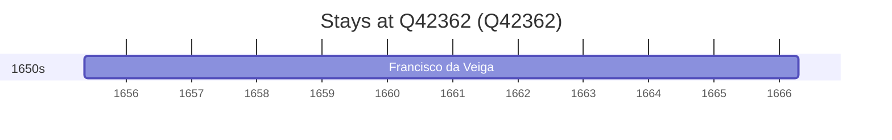

# Q42362

*(fetch error: HTTP Error 429: Too Many Requests)*

Wikidata: [Q42362](https://www.wikidata.org/wiki/Q42362)

1 occurrence(s) across 1 transcribed value(s), 1 person(s).

**Transcribed variants:**

- `Maranhão, Brasil` (1×, 1655–1655)

| Date | Variant | Person | Type | Entity id | Real entity |
|------|---------|--------|------|-----------|-------------|
| 1655-05-16 | Maranhão, Brasil | Francisco da Veiga | chegada | [deh-francisco-da-veiga](deh-francisco-da-veiga) | — |

