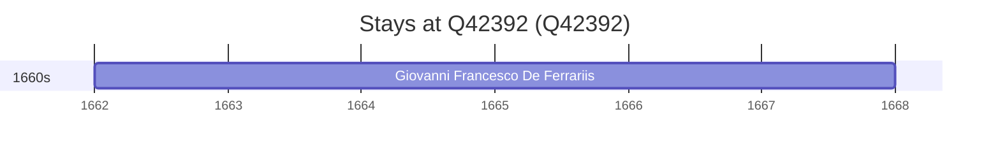

# Q42392

*(fetch error: HTTP Error 429: Too Many Requests)*

Wikidata: [Q42392](https://www.wikidata.org/wiki/Q42392)

1 occurrence(s) across 1 transcribed value(s), 1 person(s).

**Transcribed variants:**

- `Kansu (Kan-sou)` (1×, 1662–1662)

| Date | Variant | Person | Type | Entity id | Real entity |
|------|---------|--------|------|-----------|-------------|
| 1662 | Kansu (Kan-sou) | Giovanni Francesco De Ferrariis | estadia | [deh-giovanni-francesco-de-ferrariis](deh-giovanni-francesco-de-ferrariis) | — |

