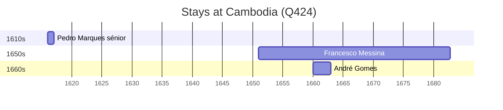

# Cambodia (Q424)

*country in Southeast Asia*

Wikidata: [Q424](https://www.wikidata.org/wiki/Q424)

8 occurrence(s) across 1 transcribed value(s), 7 person(s).

**Transcribed variants:**

- `Cambodja` (8×, 1616–1699)

| Date | Variant | Person | Type | Entity id | Real entity |
|------|---------|--------|------|-----------|-------------|
| — | Cambodja | Carlo Della Rocca | estadia | [deh-carlo-della-rocca](deh-carlo-della-rocca) | — |
| — | Cambodja | Giuseppe Candone | estadia | [deh-giuseppe-candone](deh-giuseppe-candone) | — |
| — | Cambodja | Ignace Baudet de Beauregard | estadia | [deh-ignace-baudet-de-beauregard](deh-ignace-baudet-de-beauregard) | — |
| — | Cambodja | Jean-Baptiste Maldonado | estadia | [deh-jean-baptiste-maldonado](deh-jean-baptiste-maldonado) | — |
| 1616 | Cambodja | Pedro Marques, sénior | estadia | [deh-pedro-marques-senior](deh-pedro-marques-senior) | — |
| 1651 | Cambodja | Francesco Messina | estadia | [deh-francesco-messina](deh-francesco-messina) | — |
| 1660 | Cambodja | André Gomes | estadia | [deh-andre-gomes](deh-andre-gomes) | — |
| 1699-08-05 | Cambodja | Jean-Baptiste Maldonado | morte | [deh-jean-baptiste-maldonado](deh-jean-baptiste-maldonado) | — |

### Co-presence

These persons were plausibly at this place during overlapping periods (interval estimation from stay dates; rough — see method note below).

| Period | Persons |
|--------|---------|
| 1660s | [André Gomes](deh-andre-gomes), [Francesco Messina](deh-francesco-messina) |

*1 overlapping pair(s) involving 2 person(s). Method: interval start = stay event date; end = next embarque/partida/different-place event, or death, or +15yr cap.*

