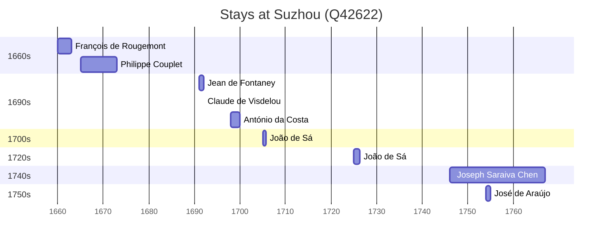

# Suzhou (Q42622)

*prefecture-level city in Jiangsu, China, former capital of the kingdom of Wu*

Wikidata: [Q42622](https://www.wikidata.org/wiki/Q42622)

13 occurrence(s) across 8 transcribed value(s), 11 person(s).

**Transcribed variants:**

- `Soochow` (5×, 1660–1746)
- `Soochow, Sou-tcheou fou` (1×, 1692–1692)
- `Soochow, Kiangnan` (2×, 1705–1725)
- `Soochow fou` (1×, 1748–1748)
- `Soochow, Sou-tcheou` (1×, 1748–1748)
- `Kiangnan, Soochow (Sou-tcheou)` (1×, 1753–1753)
- `Cantão` (1×, undated)
- `Soochow, Kiang-nan` (1×, undated)

| Date | Variant | Person | Type | Entity id | Real entity |
|------|---------|--------|------|-----------|-------------|
| — | Soochow, Kiang-nan | Jean Baborier | estadia | [deh-jean-baborier](deh-jean-baborier) | — |
| 1660 | Soochow | François de Rougemont | estadia | [deh-francois-de-rougemont](deh-francois-de-rougemont) | — |
| 1665 | Soochow | Philippe Couplet | estadia | [deh-philippe-couplet](deh-philippe-couplet) | [rp551005](rp551005) |
| 1691 | Soochow | Jean de Fontaney | estadia | [deh-jean-de-fontaney](deh-jean-de-fontaney) | — |
| 1692-01-01 | Soochow, Sou-tcheou fou | Claude de Visdelou | jesuita-votos-local | [deh-claude-de-visdelou](deh-claude-de-visdelou) | — |
| 1698 | Soochow | António da Costa | estadia | [deh-antonio-da-costa-iii](deh-antonio-da-costa-iii) | — |
| 1705 | Soochow, Kiangnan | João de Sá | estadia | [deh-joao-de-sa](deh-joao-de-sa) | — |
| 1725 | Soochow, Kiangnan | João de Sá | estadia | [deh-joao-de-sa](deh-joao-de-sa) | — |
| 1746 | Soochow | Joseph Saraiva Chen | estadia | [deh-joseph-saraiva-chen](deh-joseph-saraiva-chen) | — |
| 1748-08-13 | Soochow fou | António-José Henriques | morte | [deh-antonio-jose-henriques](deh-antonio-jose-henriques) | — |
| 1748-09-13 | Soochow, Sou-tcheou | Tristano Attimis | morte | [deh-tristano-attimis](deh-tristano-attimis) | — |
| 1753-12-08 | Kiangnan, Soochow (Sou-tcheou) | José de Araújo | estadia | [deh-jose-de-araujo](deh-jose-de-araujo) | — |
| <1671 | Cantão | Philippe Couplet | estadia | [deh-philippe-couplet](deh-philippe-couplet) | [rp551005](rp551005) |

### Co-presence

These persons were plausibly at this place during overlapping periods (interval estimation from stay dates; rough — see method note below).

| Period | Persons |
|--------|---------|
| 1750s | [Joseph Saraiva Chen](deh-joseph-saraiva-chen), [José de Araújo](deh-jose-de-araujo) |

*1 overlapping pair(s) involving 2 person(s). Method: interval start = stay event date; end = next embarque/partida/different-place event, or death, or +15yr cap.*

