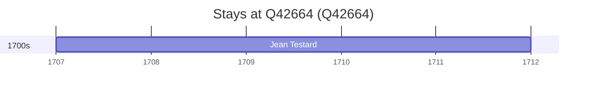

# Q42664

*(fetch error: HTTP Error 429: Too Many Requests)*

Wikidata: [Q42664](https://www.wikidata.org/wiki/Q42664)

2 occurrence(s) across 2 transcribed value(s), 1 person(s).

**Transcribed variants:**

- `Huchow, Hou-tcheou` (1×, 1707–1707)
- `Hou-tcheou fou` (1×, 1718–1718)

| Date | Variant | Person | Type | Entity id | Real entity |
|------|---------|--------|------|-----------|-------------|
| 1707 | Huchow, Hou-tcheou | Jean Testard | estadia | [deh-jean-testard](deh-jean-testard) | — |
| 1718 | Hou-tcheou fou | Jean Testard | morte | [deh-jean-testard](deh-jean-testard) | — |

