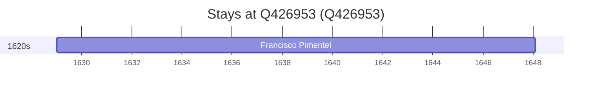

# Q426953

*(fetch error: HTTP Error 429: Too Many Requests)*

Wikidata: [Q426953](https://www.wikidata.org/wiki/Q426953)

1 occurrence(s) across 1 transcribed value(s), 1 person(s).

**Transcribed variants:**

- `Arganil, diocese de Coimbra` (1×, 1629–1629)

| Date | Variant | Person | Type | Entity id | Real entity |
|------|---------|--------|------|-----------|-------------|
| 1629 | Arganil, diocese de Coimbra | Francisco Pimentel | nascimento | [deh-francisco-pimentel](deh-francisco-pimentel) | — |

