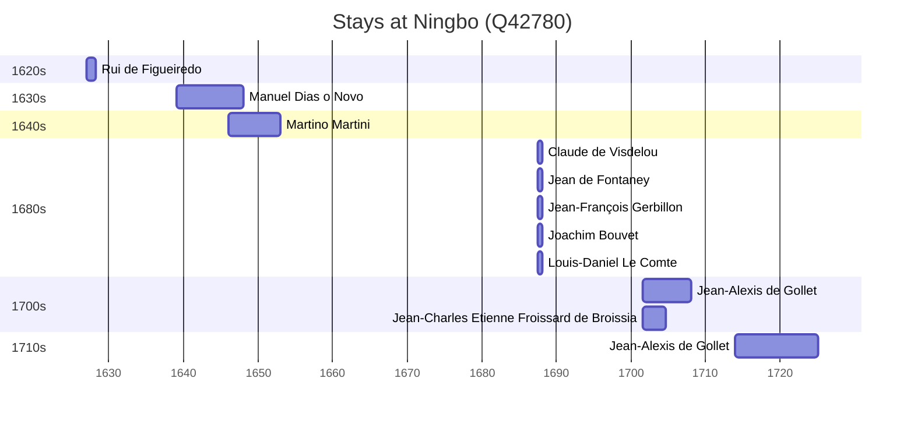

# Ningbo (Q42780)

*prefecture-level city in Zhejiang, China*

Wikidata: [Q42780](https://www.wikidata.org/wiki/Q42780)

11 occurrence(s) across 3 transcribed value(s), 10 person(s).

**Transcribed variants:**

- `Ningpo` (9×, 1627–1714)
- `Ningpo Tchö-kiang` (1×, 1687–1687)
- `Ningpo, Tchö-kiang` (1×, 1701–1701)

| Date | Variant | Person | Type | Entity id | Real entity |
|------|---------|--------|------|-----------|-------------|
| 1627 | Ningpo | Rui de Figueiredo | estadia | [deh-rui-de-figueiredo](deh-rui-de-figueiredo) | — |
| 1639 | Ningpo | Manuel Dias, o Novo | estadia | [deh-manuel-dias-o-novo](deh-manuel-dias-o-novo) | — |
| 1646 | Ningpo | Martino Martini | estadia | [deh-martino-martini](deh-martino-martini) | — |
| 1687-07-23 | Ningpo Tchö-kiang | Claude de Visdelou | chegada | [deh-claude-de-visdelou](deh-claude-de-visdelou) | — |
| 1687-07-23 | Ningpo | Jean de Fontaney | chegada | [deh-jean-de-fontaney](deh-jean-de-fontaney) | — |
| 1687-07-23 | Ningpo | Jean-François Gerbillon | estadia | [deh-jean-francois-gerbillon](deh-jean-francois-gerbillon) | — |
| 1687-07-23 | Ningpo | Joachim Bouvet | estadia | [deh-joachim-bouvet](deh-joachim-bouvet) | [rp407623](rp407623) |
| 1687-07-23 | Ningpo | Louis-Daniel Le Comte | chegada | [deh-louis-daniel-le-comte](deh-louis-daniel-le-comte) | — |
| 1701-07 | Ningpo | Jean-Alexis de Gollet | estadia | [deh-jean-alexis-de-gollet](deh-jean-alexis-de-gollet) | — |
| 1701-07 | Ningpo, Tchö-kiang | Jean-Charles Etienne Froissard de Broissia | estadia | [deh-jean-charles-etienne-froissard-de-broissia](deh-jean-charles-etienne-froissard-de-broissia) | — |
| 1714 | Ningpo | Jean-Alexis de Gollet | estadia | [deh-jean-alexis-de-gollet](deh-jean-alexis-de-gollet) | — |

### Co-presence

These persons were plausibly at this place during overlapping periods (interval estimation from stay dates; rough — see method note below).

| Period | Persons |
|--------|---------|
| 1640s | [Manuel Dias, o Novo](deh-manuel-dias-o-novo), [Martino Martini](deh-martino-martini) |
| 1680s | [Claude de Visdelou](deh-claude-de-visdelou), [Jean de Fontaney](deh-jean-de-fontaney), [Jean-François Gerbillon](deh-jean-francois-gerbillon), [Joachim Bouvet](rp407623), [Louis-Daniel Le Comte](deh-louis-daniel-le-comte) |
| 1700s | [Jean-Alexis de Gollet](deh-jean-alexis-de-gollet), [Jean-Charles Etienne Froissard de Broissia](deh-jean-charles-etienne-froissard-de-broissia) |

*12 overlapping pair(s) involving 9 person(s). Method: interval start = stay event date; end = next embarque/partida/different-place event, or death, or +15yr cap.*

