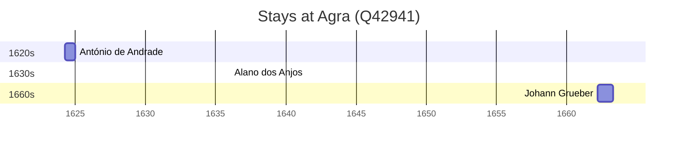

# Agra (Q42941)

*city in Uttar Pradesh, India*

Wikidata: [Q42941](https://www.wikidata.org/wiki/Q42941)

5 occurrence(s) across 1 transcribed value(s), 4 person(s).

**Transcribed variants:**

- `Agra` (5×, 1624–1663)

| Date | Variant | Person | Type | Entity id | Real entity |
|------|---------|--------|------|-----------|-------------|
| 1624-03-30 | Agra | António de Andrade | estadia | [deh-antonio-de-andrade](deh-antonio-de-andrade) | — |
| 1636 | Agra | Alano dos Anjos | estadia | [deh-alano-dos-anjos](deh-alano-dos-anjos) | — |
| 1662-03-31 | Agra | Johann Grueber | estadia | [deh-johann-grueber](deh-johann-grueber) | — |
| 1662-09-04 | Agra | Johann Grueber | estadia | [deh-johann-grueber](deh-johann-grueber) | — |
| 1663-04-08 | Agra | Albert le Comte Dorville | morte | [deh-albert-le-comte-dorville](deh-albert-le-comte-dorville) | — |

