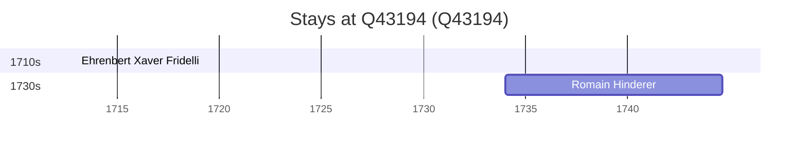

# Q43194

*(fetch error: HTTP Error 429: Too Many Requests)*

Wikidata: [Q43194](https://www.wikidata.org/wiki/Q43194)

4 occurrence(s) across 2 transcribed value(s), 3 person(s).

**Transcribed variants:**

- `Yunnan` (3×, 1713–1735)
- `Yu-nan` (1×, undated)

| Date | Variant | Person | Type | Entity id | Real entity |
|------|---------|--------|------|-----------|-------------|
| — | Yu-nan | Jean-Baptiste Régis | estadia | [deh-jean-baptiste-regis](deh-jean-baptiste-regis) | — |
| 1713 | Yunnan | Ehrenbert Xaver Fridelli | estadia | [deh-ehrenbert-xaver-fridelli](deh-ehrenbert-xaver-fridelli) | — |
| 1734 | Yunnan | Romain Hinderer | estadia | [deh-romain-hinderer](deh-romain-hinderer) | — |
| 1735 | Yunnan | Romain Hinderer | estadia | [deh-romain-hinderer](deh-romain-hinderer) | — |

