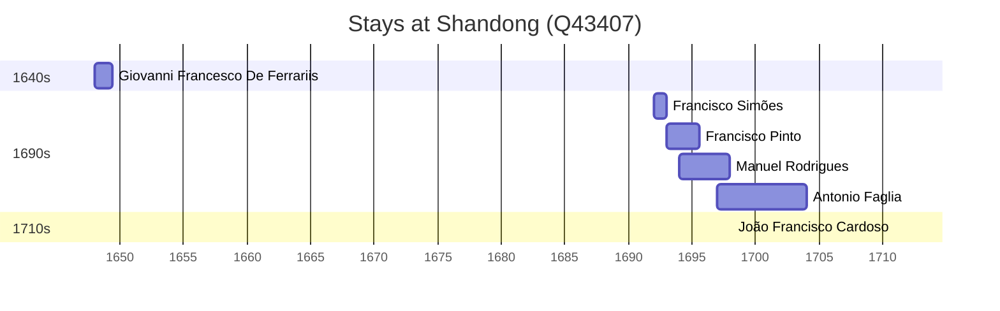

# Shandong (Q43407)

*province of China*

Wikidata: [Q43407](https://www.wikidata.org/wiki/Q43407)

9 occurrence(s) across 3 transcribed value(s), 8 person(s).

**Transcribed variants:**

- `Shantung` (7×, 1648–1711)
- `Chan-tong` (1×, 1693–1693)
- `Shangtung (Chan-tong)` (1×, undated)

| Date | Variant | Person | Type | Entity id | Real entity |
|------|---------|--------|------|-----------|-------------|
| — | Shangtung (Chan-tong) | Bernhard Diestel | estadia | [deh-bernhard-diestel](deh-bernhard-diestel) | — |
| — | Shantung | Francesco Sambiasi | estadia | [deh-francesco-sambiasi](deh-francesco-sambiasi) | — |
| 1648 | Shantung | Giovanni Francesco De Ferrariis | estadia | [deh-giovanni-francesco-de-ferrariis](deh-giovanni-francesco-de-ferrariis) | — |
| 1692 | Shantung | Francisco Simões | estadia | [deh-francisco-simoes](deh-francisco-simoes) | — |
| 1693 | Chan-tong | Francisco Pinto | estadia | [deh-francisco-pinto-i](deh-francisco-pinto-i) | — |
| 1694 | Shantung | Manuel Rodrigues | estadia | [deh-manuel-rodrigues-ii](deh-manuel-rodrigues-ii) | — |
| 1697 | Shantung | Antonio Faglia | estadia | [deh-antonio-faglia](deh-antonio-faglia) | — |
| 1700 | Shantung | Antonio Faglia | estadia | [deh-antonio-faglia](deh-antonio-faglia) | — |
| 1711 | Shantung | João Francisco Cardoso | estadia | [deh-joao-francisco-cardoso](deh-joao-francisco-cardoso) | — |

### Co-presence

These persons were plausibly at this place during overlapping periods (interval estimation from stay dates; rough — see method note below).

| Period | Persons |
|--------|---------|
| 1690s | [Antonio Faglia](deh-antonio-faglia), [Francisco Pinto](deh-francisco-pinto-i), [Manuel Rodrigues](deh-manuel-rodrigues-ii) |

*2 overlapping pair(s) involving 3 person(s). Method: interval start = stay event date; end = next embarque/partida/different-place event, or death, or +15yr cap.*

