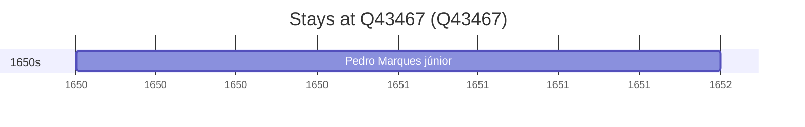

# Q43467

*(fetch error: HTTP Error 429: Too Many Requests)*

Wikidata: [Q43467](https://www.wikidata.org/wiki/Q43467)

1 occurrence(s) across 1 transcribed value(s), 1 person(s).

**Transcribed variants:**

- `Indochina` (1×, 1650–1650)

| Date | Variant | Person | Type | Entity id | Real entity |
|------|---------|--------|------|-----------|-------------|
| 1650 | Indochina | Pedro Marques, júnior | estadia | [deh-pedro-marques-junior](deh-pedro-marques-junior) | — |

