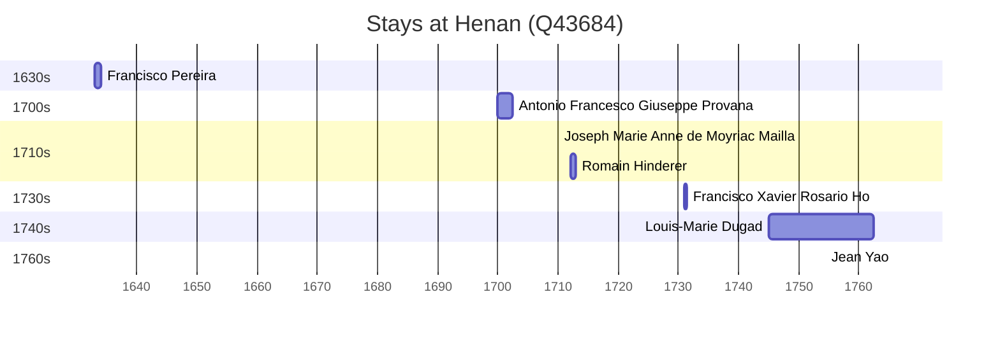

# Henan (Q43684)

*province of the People's Republic of China (1949-)*

Wikidata: [Q43684](https://www.wikidata.org/wiki/Q43684)

10 occurrence(s) across 1 transcribed value(s), 9 person(s).

**Transcribed variants:**

- `Honan` (10×, 1633–1766)

| Date | Variant | Person | Type | Entity id | Real entity |
|------|---------|--------|------|-----------|-------------|
| — | Honan | Claude-François Loppin | estadia | [deh-claude-francois-loppin](deh-claude-francois-loppin) | — |
| — | Honan | Gaspar Ferreira | estadia | [deh-gaspar-ferreira](deh-gaspar-ferreira) | — |
| — | Honan | Jean Yao | estadia | [deh-jean-yao](deh-jean-yao) | — |
| 1633 | Honan | Francisco Pereira | chegada | [deh-francisco-pereira](deh-francisco-pereira) | — |
| 1700 | Honan | Antonio Francesco Giuseppe Provana | estadia | [deh-antonio-francesco-giuseppe-provana](deh-antonio-francesco-giuseppe-provana) | [rp445313](rp445313) |
| 1710 | Honan | Joseph Marie Anne de Moyriac Mailla | estadia | [deh-joseph-marie-anne-de-moyriac-mailla](deh-joseph-marie-anne-de-moyriac-mailla) | — |
| 1712 | Honan | Romain Hinderer | estadia | [deh-romain-hinderer](deh-romain-hinderer) | — |
| 1731 | Honan | Francisco Xavier Rosario Ho | estadia | [deh-francisco-xavier-rosario-ho](deh-francisco-xavier-rosario-ho) | [rp419976](rp419976) |
| 1745 | Honan | Louis-Marie Dugad | estadia | [deh-louis-marie-dugad](deh-louis-marie-dugad) | — |
| 1766 | Honan | Jean Yao | jesuita-ordenacao-padre | [deh-jean-yao](deh-jean-yao) | — |

