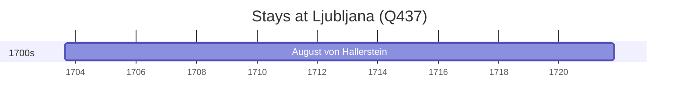

# Ljubljana (Q437)

*capital city of Slovenia*

Wikidata: [Q437](https://www.wikidata.org/wiki/Q437)

1 occurrence(s) across 1 transcribed value(s), 1 person(s).

**Transcribed variants:**

- `Laibach, Carniole` (1×, 1703–1703)

| Date | Variant | Person | Type | Entity id | Real entity |
|------|---------|--------|------|-----------|-------------|
| 1703-08-27 | Laibach, Carniole | August von Hallerstein | nascimento | [deh-august-von-hallerstein](deh-august-von-hallerstein) | — |

