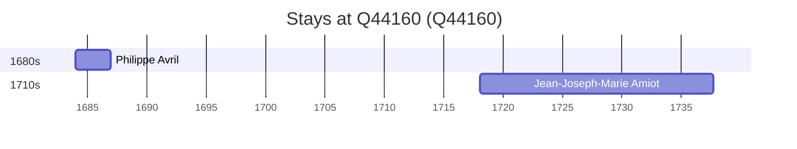

# Q44160

*(fetch error: HTTP Error 429: Too Many Requests)*

Wikidata: [Q44160](https://www.wikidata.org/wiki/Q44160)

3 occurrence(s) across 2 transcribed value(s), 2 person(s).

**Transcribed variants:**

- `Toulon` (2×, 1718–1718)
- `Touloun` (1×, undated)

| Date | Variant | Person | Type | Entity id | Real entity |
|------|---------|--------|------|-----------|-------------|
| 1718-02-08 | Toulon | Jean-Joseph-Marie Amiot | nascimento | [deh-jean-joseph-marie-amiot](deh-jean-joseph-marie-amiot) | — |
| 1718-02-08 | Toulon | Jean-Joseph-Marie Amiot | baptizado | [deh-jean-joseph-marie-amiot](deh-jean-joseph-marie-amiot) | — |
| >1689-09-15:<1691 | Touloun | Philippe Avril | estadia | [deh-philippe-avril](deh-philippe-avril) | [rp636254](rp636254) |

