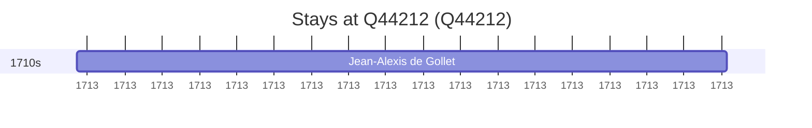

# Q44212

*(fetch error: HTTP Error 429: Too Many Requests)*

Wikidata: [Q44212](https://www.wikidata.org/wiki/Q44212)

1 occurrence(s) across 1 transcribed value(s), 1 person(s).

**Transcribed variants:**

- `Fungyang fou, Kiang-nan` (1×, 1713–1713)

| Date | Variant | Person | Type | Entity id | Real entity |
|------|---------|--------|------|-----------|-------------|
| 1713-09 | Fungyang fou, Kiang-nan | Jean-Alexis de Gollet | estadia | [deh-jean-alexis-de-gollet](deh-jean-alexis-de-gollet) | — |

