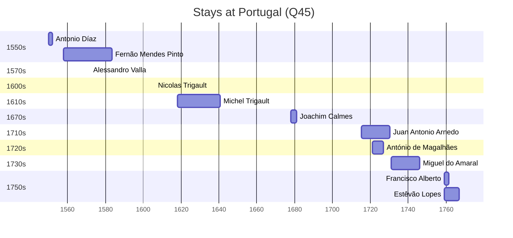

# Portugal (Q45)

*country in Southwestern Europe*

Wikidata: [Q45](https://www.wikidata.org/wiki/Q45)

20 occurrence(s) across 2 transcribed value(s), 19 person(s).

**Transcribed variants:**

- `Portugal` (19×, 1550–1782)
- `[No mar, perto da costa de Portugal]` (1×, 1708–1708)

| Date | Variant | Person | Type | Entity id | Real entity |
|------|---------|--------|------|-----------|-------------|
| — | Portugal | Luís de Mendanha | nascimento | [deh-luis-de-mendanha](deh-luis-de-mendanha) | — |
| — | Portugal | Manuel Ferreyra | estadia | [deh-manuel-ferreira-ref1](deh-manuel-ferreira-ref1) | — |
| — | Portugal | Melchior Dias | estadia | [deh-melchor-diaz-ref1](deh-melchor-diaz-ref1) | — |
| 1550 | Portugal | Antonio Díaz | jesuita-entrada | [deh-antonio-diaz](deh-antonio-diaz) | — |
| 1558 | Portugal | Fernão Mendes Pinto | estadia | [deh-fernao-mendes-pinto](deh-fernao-mendes-pinto) | — |
| 1572 | Portugal | Alessandro Valla | estadia | [deh-alessandro-valla](deh-alessandro-valla) | — |
| 1606 | Portugal | Nicolas Trigault | estadia | [deh-nicolas-trigault](deh-nicolas-trigault) | — |
| 1618-01-09 | Portugal | Michel Trigault | jesuita-entrada | [deh-michel-trigault](deh-michel-trigault) | — |
| 1678 | Portugal | Joachim Calmes | jesuita-entrada | [deh-joachim-calmes](deh-joachim-calmes) | — |
| 1708-01-20 | [No mar, perto da costa de Portugal] | Antoine de Beauvollier | morte | [deh-antoine-de-beauvollier](deh-antoine-de-beauvollier) | — |
| 1721 | Portugal | António de Magalhães | estadia | [deh-antonio-de-magalhaes](deh-antonio-de-magalhaes) | — |
| 1724 | Portugal | Manuel de Sá | partida | [deh-manuel-de-sa](deh-manuel-de-sa) | — |
| 1725 | Portugal | António de Magalhães | estadia | [deh-antonio-de-magalhaes](deh-antonio-de-magalhaes) | — |
| 1740 | Portugal | Emmanuel de Silva Tchang | partida | [deh-emmanuel-de-silva-tchang](deh-emmanuel-de-silva-tchang) | [rp840713](rp840713) |
| 1759 | Portugal | Francisco Alberto | estadia | [deh-francisco-alberto](deh-francisco-alberto) | — |
| 1759-01-24 | Portugal | Estêvão Lopes | estadia | [deh-estevao-lopes](deh-estevao-lopes) | — |
| 1760-12-20 | Portugal | António Ferreira | partida | [deh-antonio-ferreira-ref2](deh-antonio-ferreira-ref2) | — |
| 1782 | Portugal | José da Silva | morte | [deh-jose-da-silva](deh-jose-da-silva) | — |
| >1695-08-15:<1699 | Portugal | Miguel do Amaral | estadia | [deh-miguel-do-amaral](deh-miguel-do-amaral) | [rp086368](rp086368) |
| >1712-08-27:<1715-03-31 | Portugal | Juan Antonio Arnedo | estadia | [deh-juan-antonio-arnedo](deh-juan-antonio-arnedo) | [rp780907](rp780907) |

### Co-presence

These persons were plausibly at this place during overlapping periods (interval estimation from stay dates; rough — see method note below).

| Period | Persons |
|--------|---------|
| 1570s | [Alessandro Valla](deh-alessandro-valla), [Fernão Mendes Pinto](deh-fernao-mendes-pinto) |
| 1750s | [Estêvão Lopes](deh-estevao-lopes), [Francisco Alberto](deh-francisco-alberto) |

*2 overlapping pair(s) involving 4 person(s). Method: interval start = stay event date; end = next embarque/partida/different-place event, or death, or +15yr cap.*

