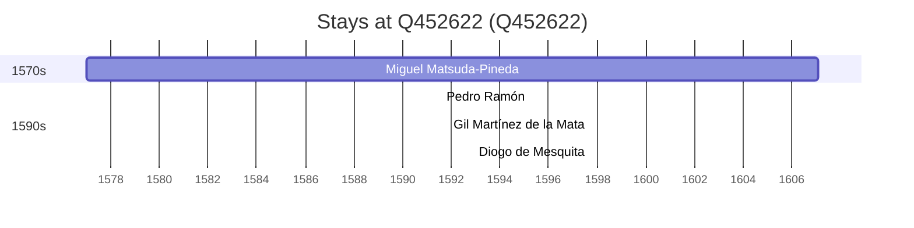

# Q452622

*(fetch error: HTTP Error 429: Too Many Requests)*

Wikidata: [Q452622](https://www.wikidata.org/wiki/Q452622)

4 occurrence(s) across 2 transcribed value(s), 4 person(s).

**Transcribed variants:**

- `Shiki, ilha de Amakusa` (1×, 1577–1577)
- `Amakusa` (3×, 1591–1592)

| Date | Variant | Person | Type | Entity id | Real entity |
|------|---------|--------|------|-----------|-------------|
| 1577 | Shiki, ilha de Amakusa | Miguel Matsuda-Pineda | nascimento | [deh-miguel-matsuda-pineda](deh-miguel-matsuda-pineda) | — |
| 1591-08-01 | Amakusa | Pedro Ramón | jesuita-votos-local | [deh-pedro-ramon](deh-pedro-ramon) | — |
| 1591-11-10 | Amakusa | Gil Martínez de la Mata | jesuita-votos-local | [deh-gil-martinez-de-la-mata](deh-gil-martinez-de-la-mata) | — |
| 1592-11-22 | Amakusa | Diogo de Mesquita | jesuita-votos-local | [deh-diogo-de-mesquita](deh-diogo-de-mesquita) | — |

### Co-presence

These persons were plausibly at this place during overlapping periods (interval estimation from stay dates; rough — see method note below).

| Period | Persons |
|--------|---------|
| 1590s | [Diogo de Mesquita](deh-diogo-de-mesquita), [Gil Martínez de la Mata](deh-gil-martinez-de-la-mata), [Miguel Matsuda-Pineda](deh-miguel-matsuda-pineda), [Pedro Ramón](deh-pedro-ramon) |

*3 overlapping pair(s) involving 4 person(s). Method: interval start = stay event date; end = next embarque/partida/different-place event, or death, or +15yr cap.*

