# Coimbra (Q45412)

*municipality in Portugal*

Wikidata: [Q45412](https://www.wikidata.org/wiki/Q45412)

97 occurrence(s) across 2 transcribed value(s), 80 person(s).

**Transcribed variants:**

- `Coimbra` (96×, 1519–1753)
- `Coimbra (seminário)` (1×, 1783–1783)

| Date | Variant | Person | Type | Entity id | Real entity |
|------|---------|--------|------|-----------|-------------|
| 1519 | Coimbra | Belchior Miguel Carneiro Leitão | nascimento | [deh-belchior-miguel-carneiro-leitao](deh-belchior-miguel-carneiro-leitao) | [rp973077](rp973077) |
| 1542 | Coimbra | Pedro de Alcáçova | jesuita-entrada | [deh-pedro-de-alcacova](deh-pedro-de-alcacova) | — |
| 1542 | Coimbra | Pedro Martins | nascimento | [deh-pedro-martins](deh-pedro-martins) | — |
| 1543-03-11 | Coimbra | Belchior Nunes Barreto | jesuita-entrada | [deh-belchior-nunes-barreto](deh-belchior-nunes-barreto) | [rp606650](rp606650) |
| 1543-04-25 | Coimbra | Belchior Miguel Carneiro Leitão | jesuita-entrada | [deh-belchior-miguel-carneiro-leitao](deh-belchior-miguel-carneiro-leitao) | [rp973077](rp973077) |
| 1544-01-25 | Coimbra | Francisco Pérez | jesuita-entrada | [deh-francisco-perez](deh-francisco-perez) | [rp892854](rp892854) |
| 1544-04-18 | Coimbra | Tibúrcio de Quadros | jesuita-entrada | [deh-tiburcio-de-quadros](deh-tiburcio-de-quadros) | — |
| 1549-01-01 | Coimbra | Gonçalo Álvares | jesuita-entrada | [deh-goncalo-alvares](deh-goncalo-alvares) | [rp127859](rp127859) |
| 1550-01-03 | Coimbra | Cristóvão da Costa | jesuita-entrada | [deh-cristovao-da-costa](deh-cristovao-da-costa) | — |
| 1556-05-25 | Coimbra | Pedro Martins | jesuita-entrada | [deh-pedro-martins](deh-pedro-martins) | — |
| 1560-03-14 | Coimbra | Lourenço Mexia | jesuita-entrada | [deh-lourenco-mexia](deh-lourenco-mexia) | — |
| 1560-06-09 | Coimbra | Gonçalo Álvares | jesuita-votos-local | [deh-goncalo-alvares](deh-goncalo-alvares) | [rp127859](rp127859) |
| 1562-05-02 | Coimbra | Nicolau Pimenta | jesuita-entrada | [deh-nicolau-pimenta](deh-nicolau-pimenta) | — |
| 1570-04-23 | Coimbra | Lourenço Mexia | jesuita-votos-local | [deh-lourenco-mexia](deh-lourenco-mexia) | — |
| 1573 | Coimbra | Pedro Ramón | jesuita-ordenacao-padre | [deh-pedro-ramon](deh-pedro-ramon) | — |
| 1574-02 | Coimbra | Francisco Vieira | jesuita-entrada | [deh-francisco-vieira](deh-francisco-vieira) | — |
| 1575-09-26 | Coimbra | Manuel Gaspar | jesuita-entrada | [deh-manuel-gaspar](deh-manuel-gaspar) | — |
| 1576 | Coimbra | António de Abreu | jesuita-entrada | [deh-antonio-de-abreu-ref1](deh-antonio-de-abreu-ref1) | — |
| 1576-01-04 | Coimbra | António de Almeida | jesuita-entrada | [deh-antonio-de-almeida](deh-antonio-de-almeida) | — |
| 1576-12-16 | Coimbra | João Rodrigues Girão | jesuita-entrada | [deh-joao-rodrigues-girao](deh-joao-rodrigues-girao) | — |
| 1577 | Coimbra | Duarte de Sande | jesuita-ordenacao-padre | [deh-duarte-de-sande](deh-duarte-de-sande) | — |
| 1577-06 | Coimbra | Matteo Ricci | estadia-x | [deh-matteo-ricci](deh-matteo-ricci) | [rp302155](rp302155) |
| 1583 | Coimbra | João da Rocha | jesuita-entrada | [deh-joao-da-rocha](deh-joao-da-rocha) | — |
| 1583-12-22 | Coimbra | Mateus de Couros | jesuita-entrada | [deh-mateus-de-couros](deh-mateus-de-couros) | — |
| 1584 | Coimbra | João Soeiro | jesuita-entrada | [deh-joao-soeiro](deh-joao-soeiro) | — |
| 1584-01-10 | Coimbra | Diogo Correia Valente | jesuita-entrada | [deh-diogo-correia-valente](deh-diogo-correia-valente) | — |
| 1584-01-14 | Coimbra | André Palmeiro | jesuita-entrada | [deh-andre-palmeiro](deh-andre-palmeiro) | [rp983183](rp983183) |
| 1586 | Coimbra | Francisco Pacheco | jesuita-entrada | [deh-francisco-pacheco](deh-francisco-pacheco) | — |
| 1589 | Coimbra | Simão da Cunha | nascimento | [deh-simao-da-cunha](deh-simao-da-cunha) | — |
| 1589-03 | Coimbra | Gaspar Ferreira | jesuita-entrada | [deh-gaspar-ferreira](deh-gaspar-ferreira) | — |
| 1591-02-03 | Coimbra | Sebastião Vieira | jesuita-entrada | [deh-sebastiao-vieira](deh-sebastiao-vieira) | — |
| 1593-02-02 | Coimbra | Manuel Dias, o Novo | jesuita-entrada | [deh-manuel-dias-o-novo](deh-manuel-dias-o-novo) | — |
| 1593-12-15 | Coimbra | Feliciano da Silva | jesuita-entrada | [deh-feliciano-da-silva](deh-feliciano-da-silva) | — |
| 1596-12-16 | Coimbra | António de Andrade | jesuita-entrada | [deh-antonio-de-andrade](deh-antonio-de-andrade) | — |
| 1603-07-27 | Coimbra | André Palmeiro | jesuita-votos-local | [deh-andre-palmeiro](deh-andre-palmeiro) | [rp983183](rp983183) |
| 1606-01-13 | Coimbra | Simão da Cunha | jesuita-entrada | [deh-simao-da-cunha](deh-simao-da-cunha) | — |
| 1607 | Coimbra | Manuel Rodrigues | nascimento | [deh-manuel-rodrigues-ii-ref3](deh-manuel-rodrigues-ii-ref3) | — |
| 1608-05-02 | Coimbra | António de Gouveia | jesuita-entrada | [deh-antonio-de-gouvea](deh-antonio-de-gouvea) | — |
| 1608-06-01 | Coimbra | Gaspar do Amaral | jesuita-entrada | [deh-gaspar-do-amaral](deh-gaspar-do-amaral) | — |
| 1610 | Coimbra | Francisco Furtado | jesuita-entrada | [deh-francisco-furtado](deh-francisco-furtado) | — |
| 1611 | Coimbra | Sebastião da Maia | jesuita-entrada | [deh-sebastiao-da-maia](deh-sebastiao-da-maia) | — |
| 1616 | Coimbra | Gaspar Luís | estadia-x | [deh-gaspar-luis](deh-gaspar-luis) | — |
| 1618 | Coimbra | Gaspar Luís | estadia-x | [deh-gaspar-luis](deh-gaspar-luis) | — |
| 1621 | Coimbra | Manuel Jorge | nascimento | [deh-manuel-jorge](deh-manuel-jorge) | — |
| 1625 | Coimbra | Gabriel de Magalhães | jesuita-entrada | [deh-gabriel-de-magalhaes](deh-gabriel-de-magalhaes) | [rp695666](rp695666) |
| 1629-05-10 | Coimbra | Matias da Maia | jesuita-entrada | [deh-matias-da-maia](deh-matias-da-maia) | — |
| 1634 | Coimbra | Gonçalo da Fonseca | jesuita-entrada | [deh-goncalo-da-fonseca](deh-goncalo-da-fonseca) | — |
| 1635 | Coimbra | Adriano Pestana | jesuita-entrada | [deh-adriano-pestana](deh-adriano-pestana) | — |
| 1638 | Coimbra | Manuel Jorge | jesuita-entrada | [deh-manuel-jorge](deh-manuel-jorge) | — |
| 1640 | Coimbra | André Ferrão | jesuita-entrada | [deh-andre-ferrao](deh-andre-ferrao) | [rp773563](rp773563) |
| 1640-08-26 | Coimbra | Adriano Pestana | estadia-x | [deh-adriano-pestana](deh-adriano-pestana) | — |
| 1649 | Coimbra | Afonso Aires | jesuita-entrada | [deh-afonso-aires](deh-afonso-aires) | — |
| 1649 | Coimbra | Aires de Almeida | estadia | [deh-afonso-aires-ref1](deh-afonso-aires-ref1) | — |
| 1661-09-25 | Coimbra | Tomé (Sancho) Pereira | jesuita-entrada | [deh-tome-pereira](deh-tome-pereira) | — |
| 1664 | Coimbra | Manuel de Siqueira Tcheng | jesuita-ordenacao-padre | [deh-manuel-de-siqueira-tcheng](deh-manuel-de-siqueira-tcheng) | [rp166098](rp166098) |
| 1664-03-25 | Coimbra | André Carneiro | jesuita-entrada | [deh-andre-carneiro](deh-andre-carneiro) | — |
| 1669-03-19 | Coimbra | António da Silva | jesuita-entrada | [deh-antonio-da-silva](deh-antonio-da-silva) | — |
| 1669-05 | Coimbra | António Lopes, júnior | nascimento | [deh-antonio-lopes-junior](deh-antonio-lopes-junior) | — |
| 1669-05-12 | Coimbra | António Lopes, júnior | baptizado | [deh-antonio-lopes-junior](deh-antonio-lopes-junior) | — |
| 1673-03-15 | Coimbra | Manuel Mendes | jesuita-entrada | [deh-manuel-mendes](deh-manuel-mendes) | [rp352197](rp352197) |
| 1675 | Coimbra | Matias Rodrigues | nascimento | [deh-matias-rodrigues](deh-matias-rodrigues) | — |
| 1675-02-13 | Coimbra | Manuel de Sá | jesuita-entrada | [deh-manuel-de-sa](deh-manuel-de-sa) | — |
| 1677-05-27 | Coimbra | Francisco Pinto | jesuita-entrada | [deh-francisco-pinto-i](deh-francisco-pinto-i) | — |
| 1677-07-01 | Coimbra | Miguel do Amaral | jesuita-entrada | [deh-miguel-do-amaral](deh-miguel-do-amaral) | [rp086368](rp086368) |
| 1678 | Coimbra | Antoine Thomas | estadia-x | [deh-antoine-thomas](deh-antoine-thomas) | [rp486350](rp486350) |
| 1678-02-15 | Coimbra | Manuel Osório | jesuita-entrada | [deh-manuel-osorio-i](deh-manuel-osorio-i) | — |
| 1679-12-18 | Coimbra | Adam Weidenfied | estadia | [deh-adam-weidenfied](deh-adam-weidenfied) | — |
| 1681-01-06 | Coimbra | Joachim Calmes | estadia-x | [deh-joachim-calmes](deh-joachim-calmes) | — |
| 1681-05-15 | Coimbra | Estanislau Machado | jesuita-entrada | [deh-estanislau-machado](deh-estanislau-machado) | — |
| 1684-12-25 | Coimbra | António Lopes, júnior | jesuita-entrada | [deh-antonio-lopes-junior](deh-antonio-lopes-junior) | — |
| 1686-03-03 | Coimbra | Leonardo Teixeira | jesuita-entrada | [deh-leonardo-teixeira](deh-leonardo-teixeira) | — |
| 1687-08-15 | Coimbra | António da Silva | jesuita-votos-local | [deh-antonio-da-silva](deh-antonio-da-silva) | — |
| 1689-12-27 | Coimbra | Francisco Moreira | nascimento | [deh-francisco-moreira](deh-francisco-moreira) | — |
| 1692-01-27 | Coimbra | Estêvão Collasco | jesuita-entrada | [deh-estevao-collasco](deh-estevao-collasco) | — |
| 1692-10-19 | Coimbra | António de Magalhães | jesuita-entrada | [deh-antonio-de-magalhaes](deh-antonio-de-magalhaes) | — |
| 1693-03-10 | Coimbra | Antão Dantas | jesuita-entrada | [deh-antao-dantas](deh-antao-dantas) | — |
| 1693-10-30 | Coimbra | Manuel Ribeiro, sénior | jesuita-entrada | [deh-manuel-ribeiro-senior](deh-manuel-ribeiro-senior) | — |
| 1694-01-30 | Coimbra | Matias Rodrigues | jesuita-entrada | [deh-matias-rodrigues](deh-matias-rodrigues) | — |
| 1697-01-26 | Coimbra | Policarpo de Sousa | nascimento | [deh-policarpo-de-sousa](deh-policarpo-de-sousa) | [rp953824](rp953824) |
| 1699-04-24 | Coimbra | António de Melo | jesuita-entrada | [deh-antonio-de-melo](deh-antonio-de-melo) | — |
| 1704-12-24 | Coimbra | Luís de Caldas | jesuita-entrada | [deh-luis-de-caldas](deh-luis-de-caldas) | — |
| 1708-01-03 | Coimbra | José Montanha | nascimento | [deh-jose-montanha-ii](deh-jose-montanha-ii) | — |
| 1708-03-21 | Coimbra | Estêvão Lopes | jesuita-entrada | [deh-estevao-lopes](deh-estevao-lopes) | — |
| 1709 | Coimbra | Giuseppe Castiglione | estadia | [deh-giuseppe-castiglione](deh-giuseppe-castiglione) | — |
| 1714-11-11 | Coimbra | Xavier Duarte | nascimento | [deh-xavier-duarte](deh-xavier-duarte) | — |
| 1721-05-01 | Coimbra | Bento Ferreira | nascimento | [deh-bento-ferreira](deh-bento-ferreira) | — |
| 1721-10-31 | Coimbra | José Montanha | jesuita-entrada | [deh-jose-montanha-ii](deh-jose-montanha-ii) | — |
| 1725-05-28 | Coimbra | António Gomes | jesuita-entrada | [deh-antonio-gomes](deh-antonio-gomes) | — |
| 1730-12-14 | Coimbra | Miguel do Amaral | morte | [deh-miguel-do-amaral](deh-miguel-do-amaral) | [rp086368](rp086368) |
| 1731-09-09 | Coimbra | João da Cunha | nascimento | [deh-joao-da-cunha](deh-joao-da-cunha) | — |
| 1734-12-17 | Coimbra | João Mendes | nascimento | [deh-joao-mendes](deh-joao-mendes) | — |
| 1742-04-27 | Coimbra | Inácio Pires | jesuita-entrada | [deh-inacio-pires](deh-inacio-pires) | — |
| 1753 | Coimbra | José Montanha | estadia | [deh-jose-montanha-ii](deh-jose-montanha-ii) | — |
| 1783 | Coimbra (seminário) | José da Silva | estadia | [deh-jose-da-silva](deh-jose-da-silva) | — |
| <1600-04-04 | Coimbra | Bartolomeo Tedeschi | estadia-x | [deh-bartolomeo-tedeschi](deh-bartolomeo-tedeschi) | [rp086162](rp086162) |
| <1623-03-24 | Coimbra | Gaspar do Amaral | estadia-x | [deh-gaspar-do-amaral](deh-gaspar-do-amaral) | — |
| >1606:<1607-02-05 | Coimbra | Nicolas Trigault | estadia-x | [deh-nicolas-trigault](deh-nicolas-trigault) | — |

### Co-presence

These persons were plausibly at this place during overlapping periods (interval estimation from stay dates; rough — see method note below).

| Period | Persons |
|--------|---------|
| 1540s | [Belchior Miguel Carneiro Leitão](rp973077), [Belchior Nunes Barreto](rp606650), [Gonçalo Álvares](rp127859), [Pedro Martins](deh-pedro-martins), [Pedro de Alcáçova](deh-pedro-de-alcacova), [Tibúrcio de Quadros](deh-tiburcio-de-quadros) |
| 1550s | [Belchior Miguel Carneiro Leitão](rp973077), [Belchior Nunes Barreto](rp606650), [Cristóvão da Costa](deh-cristovao-da-costa), [Gonçalo Álvares](rp127859), [Pedro Martins](deh-pedro-martins), [Tibúrcio de Quadros](deh-tiburcio-de-quadros) |
| 1560s | [Cristóvão da Costa](deh-cristovao-da-costa), [Gonçalo Álvares](rp127859), [Lourenço Mexia](deh-lourenco-mexia), [Nicolau Pimenta](deh-nicolau-pimenta), [Pedro Martins](deh-pedro-martins) |
| 1570s | [António de Almeida](deh-antonio-de-almeida), [Duarte de Sande](deh-duarte-de-sande), [Francisco Vieira](deh-francisco-vieira), [João Rodrigues Girão](deh-joao-rodrigues-girao), [Lourenço Mexia](deh-lourenco-mexia), [Manuel Gaspar](deh-manuel-gaspar), [Nicolau Pimenta](deh-nicolau-pimenta), [Pedro Ramón](deh-pedro-ramon) |
| 1580s | [André Palmeiro](rp983183), [António de Almeida](deh-antonio-de-almeida), [Diogo Correia Valente](deh-diogo-correia-valente), [Francisco Pacheco](deh-francisco-pacheco), [Francisco Vieira](deh-francisco-vieira), [Gaspar Ferreira](deh-gaspar-ferreira), [João Rodrigues Girão](deh-joao-rodrigues-girao), [João Soeiro](deh-joao-soeiro), [João da Rocha](deh-joao-da-rocha), [Manuel Gaspar](deh-manuel-gaspar), [Mateus de Couros](deh-mateus-de-couros), [Nicolau Pimenta](deh-nicolau-pimenta), [Simão da Cunha](deh-simao-da-cunha) |
| 1590s | [André Palmeiro](rp983183), [António de Andrade](deh-antonio-de-andrade), [Diogo Correia Valente](deh-diogo-correia-valente), [Feliciano da Silva](deh-feliciano-da-silva), [Francisco Pacheco](deh-francisco-pacheco), [Francisco Vieira](deh-francisco-vieira), [Gaspar Ferreira](deh-gaspar-ferreira), [João Soeiro](deh-joao-soeiro), [João da Rocha](deh-joao-da-rocha), [Manuel Dias, o Novo](deh-manuel-dias-o-novo), [Manuel Gaspar](deh-manuel-gaspar), [Mateus de Couros](deh-mateus-de-couros), [Sebastião Vieira](deh-sebastiao-vieira), [Simão da Cunha](deh-simao-da-cunha) |
| 1600s | [André Palmeiro](rp983183), [António de Andrade](deh-antonio-de-andrade), [António de Gouveia](deh-antonio-de-gouvea), [Bartolomeo Tedeschi](rp086162), [Diogo Correia Valente](deh-diogo-correia-valente), [Feliciano da Silva](deh-feliciano-da-silva), [Francisco Pacheco](deh-francisco-pacheco), [Gaspar Ferreira](deh-gaspar-ferreira), [Gaspar do Amaral](deh-gaspar-do-amaral), [Manuel Dias, o Novo](deh-manuel-dias-o-novo), [Manuel Gaspar](deh-manuel-gaspar), [Manuel Rodrigues](deh-manuel-rodrigues-ii-ref3), [Nicolas Trigault](deh-nicolas-trigault), [Sebastião Vieira](deh-sebastiao-vieira), [Simão da Cunha](deh-simao-da-cunha) |
| 1610s | [André Palmeiro](rp983183), [António de Gouveia](deh-antonio-de-gouvea), [Francisco Furtado](deh-francisco-furtado), [Gaspar Luís](deh-gaspar-luis), [Gaspar do Amaral](deh-gaspar-do-amaral), [Manuel Rodrigues](deh-manuel-rodrigues-ii-ref3), [Sebastião da Maia](deh-sebastiao-da-maia), [Simão da Cunha](deh-simao-da-cunha) |
| 1620s | [António de Gouveia](deh-antonio-de-gouvea), [Gabriel de Magalhães](rp695666), [Gaspar do Amaral](deh-gaspar-do-amaral), [Manuel Jorge](deh-manuel-jorge), [Manuel Rodrigues](deh-manuel-rodrigues-ii-ref3), [Matias da Maia](deh-matias-da-maia), [Sebastião da Maia](deh-sebastiao-da-maia), [Simão da Cunha](deh-simao-da-cunha) |
| 1630s | [Adriano Pestana](deh-adriano-pestana), [Gonçalo da Fonseca](deh-goncalo-da-fonseca), [Manuel Jorge](deh-manuel-jorge), [Manuel Rodrigues](deh-manuel-rodrigues-ii-ref3), [Matias da Maia](deh-matias-da-maia) |
| 1640s | [Adriano Pestana](deh-adriano-pestana), [Afonso Aires](deh-afonso-aires), [André Ferrão](rp773563), [Gonçalo da Fonseca](deh-goncalo-da-fonseca), [Manuel Jorge](deh-manuel-jorge), [Manuel Rodrigues](deh-manuel-rodrigues-ii-ref3), [Matias da Maia](deh-matias-da-maia) |
| 1660s | [André Carneiro](deh-andre-carneiro), [António Lopes, júnior](deh-antonio-lopes-junior), [António da Silva](deh-antonio-da-silva), [Manuel Rodrigues](deh-manuel-rodrigues-ii-ref3), [Tomé (Sancho) Pereira](deh-tome-pereira) |
| 1670s | [Adam Weidenfied](deh-adam-weidenfied), [André Carneiro](deh-andre-carneiro), [Antoine Thomas](rp486350), [António Lopes, júnior](deh-antonio-lopes-junior), [António da Silva](deh-antonio-da-silva), [Francisco Pinto](deh-francisco-pinto-i), [Manuel Mendes](rp352197), [Manuel Osório](deh-manuel-osorio-i), [Manuel de Sá](deh-manuel-de-sa), [Matias Rodrigues](deh-matias-rodrigues), [Miguel do Amaral](rp086368) |
| 1680s | [André Carneiro](deh-andre-carneiro), [António Lopes, júnior](deh-antonio-lopes-junior), [António da Silva](deh-antonio-da-silva), [Estanislau Machado](deh-estanislau-machado), [Francisco Moreira](deh-francisco-moreira), [Francisco Pinto](deh-francisco-pinto-i), [Joachim Calmes](deh-joachim-calmes), [Leonardo Teixeira](deh-leonardo-teixeira), [Manuel Mendes](rp352197), [Manuel Osório](deh-manuel-osorio-i), [Manuel de Sá](deh-manuel-de-sa), [Matias Rodrigues](deh-matias-rodrigues), [Miguel do Amaral](rp086368) |
| 1690s | [Antão Dantas](deh-antao-dantas), [António Lopes, júnior](deh-antonio-lopes-junior), [António da Silva](deh-antonio-da-silva), [António de Magalhães](deh-antonio-de-magalhaes), [António de Melo](deh-antonio-de-melo), [Estêvão Collasco](deh-estevao-collasco), [Francisco Moreira](deh-francisco-moreira), [Leonardo Teixeira](deh-leonardo-teixeira), [Manuel Ribeiro, sénior](deh-manuel-ribeiro-senior), [Manuel de Sá](deh-manuel-de-sa), [Matias Rodrigues](deh-matias-rodrigues), [Policarpo de Sousa](rp953824) |
| 1700s | [António de Melo](deh-antonio-de-melo), [Estêvão Lopes](deh-estevao-lopes), [Francisco Moreira](deh-francisco-moreira), [Giuseppe Castiglione](deh-giuseppe-castiglione), [José Montanha](deh-jose-montanha-ii), [Luís de Caldas](deh-luis-de-caldas), [Policarpo de Sousa](rp953824) |
| 1710s | [António de Melo](deh-antonio-de-melo), [Estêvão Lopes](deh-estevao-lopes), [Francisco Moreira](deh-francisco-moreira), [Giuseppe Castiglione](deh-giuseppe-castiglione), [José Montanha](deh-jose-montanha-ii), [Luís de Caldas](deh-luis-de-caldas), [Policarpo de Sousa](rp953824), [Xavier Duarte](deh-xavier-duarte) |
| 1720s | [António Gomes](deh-antonio-gomes), [Bento Ferreira](deh-bento-ferreira), [José Montanha](deh-jose-montanha-ii), [Policarpo de Sousa](rp953824), [Xavier Duarte](deh-xavier-duarte) |
| 1730s | [Bento Ferreira](deh-bento-ferreira), [José Montanha](deh-jose-montanha-ii), [João Mendes](deh-joao-mendes), [João da Cunha](deh-joao-da-cunha), [Xavier Duarte](deh-xavier-duarte) |
| 1740s | [Inácio Pires](deh-inacio-pires), [José Montanha](deh-jose-montanha-ii), [João Mendes](deh-joao-mendes), [João da Cunha](deh-joao-da-cunha), [Xavier Duarte](deh-xavier-duarte) |
| 1750s | [Inácio Pires](deh-inacio-pires), [José Montanha](deh-jose-montanha-ii) |

*389 overlapping pair(s) involving 74 person(s). Method: interval start = stay event date; end = next embarque/partida/different-place event, or death, or +15yr cap.*

```mermaid
gantt
    title Stays at Coimbra (Q45412)
    dateFormat YYYY-MM-DD
    axisFormat %Y
    section 1510s
    Belchior Miguel Carneiro Leitão :1519-01-01, 1554-06-24
    section 1540s
    Pedro de Alcáçova :1542-01-01, 1548-05-02
    Pedro Martins :1542-01-01, 1570-04-23
    Belchior Nunes Barreto :1543-03-11, 1551-01-01
    Tibúrcio de Quadros :1544-04-18, 1553-10-01
    Gonçalo Álvares :1549-01-01, 1568-12-01
    section 1550s
    Cristóvão da Costa :1550-01-03, 1561-01-01
    section 1560s
    Lourenço Mexia :1560-03-14, 1579-07-07
    Nicolau Pimenta :1562-05-02, 1586-05-28
    section 1570s
    Pedro Ramón :1573-01-01, 1573-01-01
    Francisco Vieira :1574-02-01, 1595-07-09
    Manuel Gaspar :1575-09-26, 1601-04-19
    António de Abreu :1576-01-01, 1591-01-01
    António de Almeida :1576-01-04, 1585-03-25
    João Rodrigues Girão :1576-12-16, 1586-01-01
    Duarte de Sande :1577-01-01, 1577-01-01
    section 1580s
    João da Rocha :1583-01-01, 1591-08-01
    Mateus de Couros :1583-12-22, 1595-01-01
    João Soeiro :1584-01-01, 1591-07-01
    Diogo Correia Valente :1584-01-10, 1605-01-30
    André Palmeiro :1584-01-14, 1620-01-01
    Francisco Pacheco :1586-01-01, 1603-07-06
    Simão da Cunha :1589-01-01, 1624-01-01
    Gaspar Ferreira :1589-03-01, 1604-02-01
    section 1590s
    Sebastião Vieira :1591-02-03, 1604-01-01
    Manuel Dias  o Novo :1593-02-02, 1601-01-01
    Feliciano da Silva :1593-12-15, 1604-01-01
    António de Andrade :1596-12-16, 1600-10-02
    section 1600s
    Bartolomeo Tedeschi :1600-04-04, 1600-09-01
    Nicolas Trigault :1606-01-01, 1610-01-01
    Manuel Rodrigues :1607-01-01, 1666-11-14
    António de Gouveia :1608-05-02, 1624-01-01
    Gaspar do Amaral :1608-06-01, 1623-01-01
    section 1610s
    Francisco Furtado :1610-01-01, 1619-07-15
    Sebastião da Maia :1611-01-01, 1632-12-08
    Gaspar Luís :1616-01-01, 1619-02-01
    section 1620s
    Manuel Jorge :1621-01-01, 1651-01-01
    Gaspar do Amaral :1623-03-24, 1623-03-24
    Gabriel de Magalhães :1625-01-01, 1634-01-01
    Matias da Maia :1629-05-10, 1646-01-01
    section 1630s
    Gonçalo da Fonseca :1634-01-01, 1645-01-01
    Adriano Pestana :1635-01-01, 1648-01-01
    section 1640s
    André Ferrão :1640-01-01, 1659-01-01
    Afonso Aires :1649-01-01, 1657-01-01
    Aires de Almeida :1649-01-01, 1664-01-01
    section 1660s
    Tomé (Sancho) Pereira :1661-09-25, 1673-01-01
    André Carneiro :1664-03-25, 1682-12-08
    António da Silva :1669-03-19, 1696-05-04
    António Lopes  júnior :1669-05-01, 1696-01-01
    section 1670s
    Manuel Mendes :1673-03-15, 1684-10-02
    Matias Rodrigues :1675-01-01, 1695-01-01
    Manuel de Sá :1675-02-13, 1693-08-15
    Francisco Pinto :1677-05-27, 1691-01-01
    Miguel do Amaral :1677-07-01, 1685-01-01
    Antoine Thomas :1678-01-01, 1678-02-02
    Manuel Osório :1678-02-15, 1691-01-01
    Adam Weidenfied :1679-12-18, 1680-06-04
    section 1680s
    Joachim Calmes :1681-01-06, 1684-08-01
    Estanislau Machado :1681-05-15, 1687-01-01
    Leonardo Teixeira :1686-03-03, 1697-01-01
    Francisco Moreira :1689-12-27, 1716-08-31
    section 1690s
    Estêvão Collasco :1692-01-27, 1697-01-01
    António de Magalhães :1692-10-19, 1700-01-01
    Antão Dantas :1693-03-10, 1699-10-01
    Manuel Ribeiro  sénior :1693-10-30, 1695-01-01
    Policarpo de Sousa :1697-01-26, 1725-01-01
    António de Melo :1699-04-24, 1719-12-03
    section 1700s
    Luís de Caldas :1704-12-24, 1720-01-01
    José Montanha :1708-01-03, 1742-11-05
    Estêvão Lopes :1708-03-21, 1721-01-01
    Giuseppe Castiglione :1709-01-01, 1715-07-10
    section 1710s
    Xavier Duarte :1714-11-11, 1751-01-01
    section 1720s
    Bento Ferreira :1721-05-01, 1736-01-20
    António Gomes :1725-05-28, 1727-01-01
    section 1730s
    João da Cunha :1731-09-09, 1747-11-23
    João Mendes :1734-12-17, 1749-03-09
    section 1740s
    Inácio Pires :1742-04-27, 1755-01-01
    section 1750s
    José Montanha :1753-01-01, 1759-01-01
    section 1780s
    José da Silva :1783-01-01, 1798-01-01
```

