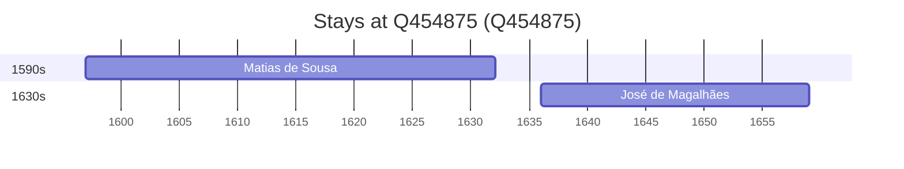

# Q454875

*(fetch error: HTTP Error 429: Too Many Requests)*

Wikidata: [Q454875](https://www.wikidata.org/wiki/Q454875)

2 occurrence(s) across 1 transcribed value(s), 2 person(s).

**Transcribed variants:**

- `Amarante, diocese de Braga` (2×, 1597–1636)

| Date | Variant | Person | Type | Entity id | Real entity |
|------|---------|--------|------|-----------|-------------|
| 1597 | Amarante, diocese de Braga | Matias de Sousa | nascimento | [deh-matias-de-sousa](deh-matias-de-sousa) | — |
| 1636 | Amarante, diocese de Braga | José de Magalhães | nascimento | [deh-jose-de-magalhaes](deh-jose-de-magalhaes) | — |

