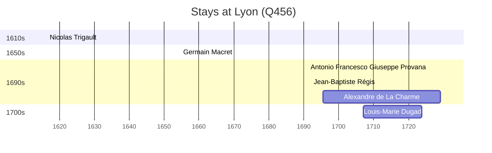

# Lyon (Q456)

*city of France*

Wikidata: [Q456](https://www.wikidata.org/wiki/Q456)

7 occurrence(s) across 3 transcribed value(s), 6 person(s).

**Transcribed variants:**

- `Lyon (igreja de S. José)` (1×, 1654–1654)
- `Lyon` (5×, 1691–1707)
- `Lyon (rue de la Sirene)` (1×, 1695–1695)

| Date | Variant | Person | Type | Entity id | Real entity |
|------|---------|--------|------|-----------|-------------|
| 1654-07-05 | Lyon (igreja de S. José) | Germain Macret | jesuita-votos-local | [deh-germain-macret](deh-germain-macret) | — |
| 1691 | Lyon | Antonio Francesco Giuseppe Provana | jesuita-ordenacao-padre | [deh-antonio-francesco-giuseppe-provana](deh-antonio-francesco-giuseppe-provana) | [rp445313](rp445313) |
| 1692 | Lyon | Jean-Baptiste Régis | jesuita-ordenacao-padre | [deh-jean-baptiste-regis](deh-jean-baptiste-regis) | — |
| 1695-07-18 | Lyon (rue de la Sirene) | Alexandre de La Charme | nascimento | [deh-alexandre-de-la-charme](deh-alexandre-de-la-charme) | — |
| 1695-07-19 | Lyon | Alexandre de La Charme | baptizado | [deh-alexandre-de-la-charme](deh-alexandre-de-la-charme) | — |
| 1707-02-26 | Lyon | Louis-Marie Dugad | nascimento | [deh-louis-marie-dugad](deh-louis-marie-dugad) | — |
| >1616-05 | Lyon | Nicolas Trigault | estadia | [deh-nicolas-trigault](deh-nicolas-trigault) | — |

### Co-presence

These persons were plausibly at this place during overlapping periods (interval estimation from stay dates; rough — see method note below).

| Period | Persons |
|--------|---------|
| 1700s | [Alexandre de La Charme](deh-alexandre-de-la-charme), [Louis-Marie Dugad](deh-louis-marie-dugad) |

*1 overlapping pair(s) involving 2 person(s). Method: interval start = stay event date; end = next embarque/partida/different-place event, or death, or +15yr cap.*

