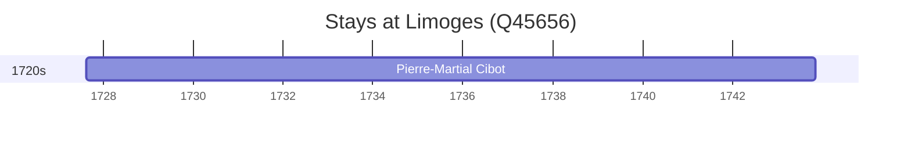

# Limoges (Q45656)

*commune in Haute-Vienne, France*

Wikidata: [Q45656](https://www.wikidata.org/wiki/Q45656)

1 occurrence(s) across 1 transcribed value(s), 1 person(s).

**Transcribed variants:**

- `Limoges` (1×, 1727–1727)

| Date | Variant | Person | Type | Entity id | Real entity |
|------|---------|--------|------|-----------|-------------|
| 1727-08-15 | Limoges | Pierre-Martial Cibot | nascimento | [deh-pierre-martial-cibot](deh-pierre-martial-cibot) | [rp459497](rp459497) |

