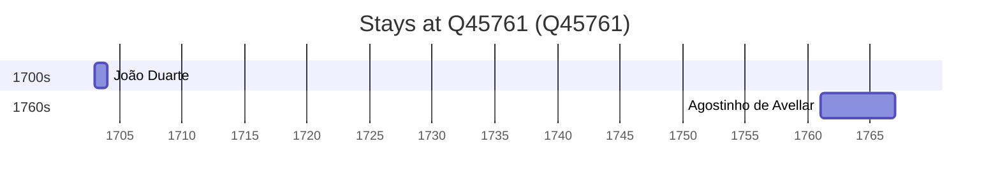

# Q45761

*(fetch error: HTTP Error 429: Too Many Requests)*

Wikidata: [Q45761](https://www.wikidata.org/wiki/Q45761)

2 occurrence(s) across 1 transcribed value(s), 2 person(s).

**Transcribed variants:**

- `Hunan` (2×, 1703–1761)

| Date | Variant | Person | Type | Entity id | Real entity |
|------|---------|--------|------|-----------|-------------|
| 1703 | Hunan | João Duarte | estadia | [deh-joao-duarte](deh-joao-duarte) | — |
| 1761 | Hunan | Agostinho de Avellar | estadia | [deh-agostinho-de-avellar](deh-agostinho-de-avellar) | — |

