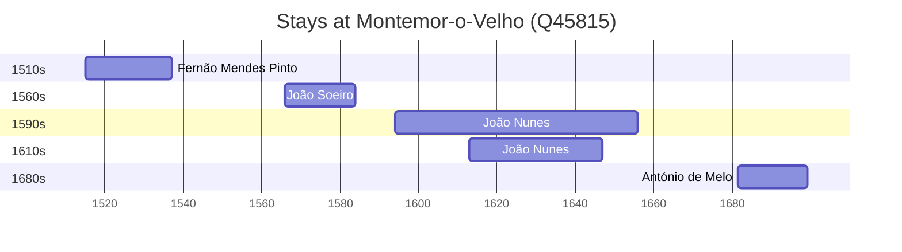

# Montemor-o-Velho (Q45815)

*municipality of Portugal*

Wikidata: [Q45815](https://www.wikidata.org/wiki/Q45815)

5 occurrence(s) across 2 transcribed value(s), 5 person(s).

**Transcribed variants:**

- `Montemor-o-Velho, diocese de Coimbra` (4×, 1515–1681)
- `Montemor` (1×, 1613–1613)

| Date | Variant | Person | Type | Entity id | Real entity |
|------|---------|--------|------|-----------|-------------|
| 1515 | Montemor-o-Velho, diocese de Coimbra | Fernão Mendes Pinto | nascimento | [deh-fernao-mendes-pinto](deh-fernao-mendes-pinto) | — |
| 1566 | Montemor-o-Velho, diocese de Coimbra | João Soeiro | nascimento | [deh-joao-soeiro](deh-joao-soeiro) | — |
| 1594 | Montemor-o-Velho, diocese de Coimbra | João Nunes | nascimento | [deh-joao-nunes-ref2](deh-joao-nunes-ref2) | — |
| 1613 | Montemor | João Nunes | nascimento | [deh-joao-nunes](deh-joao-nunes) | — |
| 1681-08-03 | Montemor-o-Velho, diocese de Coimbra | António de Melo | nascimento | [deh-antonio-de-melo](deh-antonio-de-melo) | — |

### Co-presence

These persons were plausibly at this place during overlapping periods (interval estimation from stay dates; rough — see method note below).

| Period | Persons |
|--------|---------|
| 1610s | [João Nunes](deh-joao-nunes-ref2), [João Nunes](deh-joao-nunes) |

*1 overlapping pair(s) involving 2 person(s). Method: interval start = stay event date; end = next embarque/partida/different-place event, or death, or +15yr cap.*

